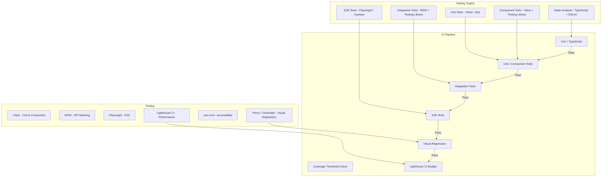

# Frontend Testing Strategy

## Architecture at a Glance



## What is it?

Frontend testing strategy defines a layered approach to verifying correctness, performance, accessibility, and visual fidelity of web applications. Modern frontend testing uses the **Testing Trophy** (over the traditional Testing Pyramid), emphasizing integration tests over isolated unit tests. The stack typically includes: **Vitest** for unit/component tests with **Testing Library** for DOM queries; **MSW (Mock Service Worker)** for API mocking in integration tests; **Playwright** or **Cypress** for E2E tests; **Percy/Chromatic** for visual regression; **axe-core** for accessibility; and **Lighthouse CI** for performance budgets.

## Why it was created

Early frontend testing was manual or relied on brittle snapshot tests and Selenium-based E2E tests that were slow and flaky. As frontend apps grew in complexity (SPAs, state management, API integration), teams needed: faster feedback (unit tests in ms, not seconds), more confidence (integration tests exercising real component interactions), and broader coverage (a11y, visual, performance). The Testing Trophy model emphasizes testing behavior over implementation, with MSW enabling integration tests without deploying a real backend.

## When to use it

- **Any production web app** — use the full stack (unit → integration → E2E → visual → a11y → perf)
- **Design system libraries** — component tests + visual regression + a11y are critical
- **API-heavy SPAs** — MSW-based integration tests for every API interaction
- **E-commerce / critical flows** — E2E tests for checkout, login, payment flows
- **Multi-team projects** — visual regression prevents unintended UI changes across teams
- **Performance-sensitive apps** — Lighthouse CI with budgets to prevent regressions

## Hands-on Example: Playwright E2E + MSW + Vitest Setup

**Vitest + Testing Library Configuration (vitest.config.ts):**
```ts
import { defineConfig } from 'vitest/config';
import react from '@vitejs/plugin-react';

export default defineConfig({
  plugins: [react()],
  test: {
    environment: 'jsdom',
    globals: true,
    setupFiles: ['./test/setup.ts'],
    include: ['src/**/*.{test,spec}.{ts,tsx}'],
    coverage: {
      provider: 'v8',
      reporter: ['text', 'json-summary', 'html', 'lcov'],
      thresholds: {
        statements: 80,
        branches: 75,
        functions: 80,
        lines: 80,
      },
      include: ['src/**/*.{ts,tsx}'],
      exclude: [
        'src/**/*.stories.{ts,tsx}',
        'src/**/*.test.{ts,tsx}',
        'src/types/**',
      ],
    },
  },
});
```

**MSW Setup for Integration Tests (test/setup.ts):**
```ts
import '@testing-library/jest-dom';
import { cleanup } from '@testing-library/react';
import { afterAll, afterEach, beforeAll } from 'vitest';
import { http, HttpResponse } from 'msw';
import { setupServer } from 'msw/node';

// Define API handlers
export const handlers = [
  http.get('/api/v1/users/:id', ({ params }) => {
    const { id } = params;
    return HttpResponse.json({
      id,
      name: 'John Doe',
      email: 'john@example.com',
      role: 'admin',
    });
  }),

  http.get('/api/v1/products', ({ request }) => {
    const url = new URL(request.url);
    const page = url.searchParams.get('page') || '1';
    const category = url.searchParams.get('category');

    const products = [
      { id: '1', name: 'Laptop', price: 1299, category: 'electronics' },
      { id: '2', name: 'Headphones', price: 199, category: 'electronics' },
      { id: '3', name: 'Desk Chair', price: 499, category: 'furniture' },
    ];

    const filtered = category
      ? products.filter((p) => p.category === category)
      : products;

    return HttpResponse.json({
      data: filtered,
      page: Number(page),
      totalPages: 5,
      total: filtered.length,
    });
  }),

  http.post('/api/v1/checkout', async ({ request }) => {
    const body = (await request.json()) as { items?: string[] };

    if (!body?.items?.length) {
      return HttpResponse.json(
        { error: 'Cart is empty' },
        { status: 400 }
      );
    }

    return HttpResponse.json({ orderId: 'ord_123', status: 'confirmed' });
  }),

  http.get('/api/v1/orders/:id', ({ params }) => {
    return HttpResponse.json({
      id: params.id,
      status: 'shipped',
      items: [
        { productId: '1', quantity: 1, price: 1299 },
      ],
      total: 1299,
    });
  }),
];

const server = setupServer(...handlers);

beforeAll(() => server.listen({ onUnhandledRequest: 'warn' }));
afterEach(() => {
  cleanup();
  server.resetHandlers();
});
afterAll(() => server.close());
```

**Unit + Component Tests (Vitest + Testing Library):**

```tsx
// src/components/ProductCard.test.tsx
import { render, screen } from '@testing-library/react';
import userEvent from '@testing-library/user-event';
import { describe, expect, it } from 'vitest';
import { ProductCard } from './ProductCard';

describe('ProductCard', () => {
  const defaultProps = {
    id: '1',
    name: 'Wireless Headphones',
    price: 199.99,
    imageUrl: '/headphones.jpg',
    onAddToCart: () => {},
  };

  it('renders product name and price', () => {
    render(<ProductCard {...defaultProps} />);
    expect(screen.getByText('Wireless Headphones')).toBeInTheDocument();
    expect(screen.getByText('$199.99')).toBeInTheDocument();
  });

  it('renders "Sold Out" badge when out of stock', () => {
    render(<ProductCard {...defaultProps} stock={0} />);
    expect(screen.getByText('Sold Out')).toBeInTheDocument();
    expect(screen.getByRole('button', { name: /add to cart/i })).toBeDisabled();
  });

  it('calls onAddToCart when button is clicked', async () => {
    const onAddToCart = vi.fn();
    render(<ProductCard {...defaultProps} onAddToCart={onAddToCart} />);

    await userEvent.click(screen.getByRole('button', { name: /add to cart/i }));
    expect(onAddToCart).toHaveBeenCalledWith('1');
  });
});
```

**Integration Test with MSW:**

```tsx
// src/pages/CheckoutPage.test.tsx
import { render, screen, waitFor } from '@testing-library/react';
import userEvent from '@testing-library/user-event';
import { describe, expect, it } from 'vitest';
import { CheckoutPage } from './CheckoutPage';
import { http, HttpResponse } from 'msw';
import { server } from '../../test/setup';

describe('CheckoutPage', () => {
  it('displays order confirmation on successful checkout', async () => {
    render(<CheckoutPage />);

    await userEvent.click(screen.getByRole('button', { name: /place order/i }));

    await waitFor(() => {
      expect(screen.getByText(/order confirmed/i)).toBeInTheDocument();
      expect(screen.getByText(/ord_123/)).toBeInTheDocument();
    });
  });

  it('shows error when cart is empty', async () => {
    // Override handler for this test
    server.use(
      http.post('/api/v1/checkout', async () => {
        return HttpResponse.json(
          { error: 'Cart is empty' },
          { status: 400 }
        );
      })
    );

    render(<CheckoutPage />);

    await userEvent.click(screen.getByRole('button', { name: /place order/i }));

    await waitFor(() => {
      expect(screen.getByText(/cart is empty/i)).toBeInTheDocument();
    });
  });
});
```

**Playwright E2E Test:**

```ts
// e2e/checkout.spec.ts
import { test, expect } from '@playwright/test';

test.describe('Checkout Flow', () => {
  test.beforeEach(async ({ page }) => {
    await page.goto('/');
    // Wait for the app to load
    await page.waitForLoadState('networkidle');
  });

  test('complete purchase flow', async ({ page }) => {
    // Browse products
    await expect(page.locator('[data-testid="product-card"]')).toHaveCount(3);

    // Add item to cart
    await page.locator('[data-testid="product-card"]').first()
      .locator('button:has-text("Add to Cart")').click();
    await expect(page.locator('[data-testid="cart-count"]')).toHaveText('1');

    // View cart
    await page.locator('[data-testid="cart-icon"]').click();
    await expect(page).toHaveURL(/\/cart/);

    // Proceed to checkout
    await page.locator('button:has-text("Checkout")').click();
    await expect(page).toHaveURL(/\/checkout/);

    // Fill shipping info
    await page.fill('[name="email"]', 'test@example.com');
    await page.fill('[name="address"]', '123 Main St');
    await page.selectOption('[name="country"]', 'US');

    // Place order
    await page.locator('button:has-text("Place Order")').click();

    // Verify confirmation
    await expect(page.locator('[data-testid="order-confirmation"]'))
      .toBeVisible();
    await expect(page.locator('[data-testid="order-id"]'))
      .not.toBeEmpty();
  });

  test('shows validation errors for empty form', async ({ page }) => {
    await page.goto('/checkout');
    await page.locator('button:has-text("Place Order")').click();

    await expect(page.locator('[data-testid="field-error"]'))
      .toHaveCount(3);
  });
});
```

**Playwright Configuration (playwright.config.ts):**
```ts
import { defineConfig, devices } from '@playwright/test';

export default defineConfig({
  testDir: './e2e',
  fullyParallel: true,
  forbidOnly: !!process.env.CI,
  retries: process.env.CI ? 2 : 0,
  workers: process.env.CI ? 4 : undefined,
  reporter: [
    ['html'],
    ['json', { outputFile: 'playwright-report/test-results.json' }],
    ['junit', { outputFile: 'playwright-report/junit.xml' }],
  ],
  use: {
    baseURL: 'http://localhost:3000',
    trace: 'on-first-retry',
    screenshot: 'only-on-failure',
    video: 'retain-on-failure',
  },
  projects: [
    {
      name: 'chromium',
      use: { ...devices['Desktop Chrome'] },
    },
    {
      name: 'firefox',
      use: { ...devices['Desktop Firefox'] },
    },
    {
      name: 'mobile-chrome',
      use: { ...devices['Pixel 5'] },
    },
  ],
  webServer: {
    command: 'npm run dev',
    port: 3000,
    reuseExistingServer: !process.env.CI,
  },
});
```

## Best Practices

- Follow the Testing Trophy: invest most in integration tests, fewer in unit and E2E
- Use MSW for all API mocking in unit/integration tests — never mock `fetch` directly
- Write tests that resemble user behavior (click buttons, fill forms, read text) using Testing Library queries
- Keep E2E tests focused on critical user journeys (login, checkout, search)
- Run visual regression tests only on changed components (Percy snapshots in CI)
- Set a11y thresholds (axe-core) in CI — fail builds that introduce violations
- Enforce coverage thresholds (80%+), but measure value not vanity
- Use Playwright's trace viewer to debug flaky E2E tests
- Mock at the network boundary (MSW) not the component boundary (avoid prop-level mocking)
- Run tests in parallel: unit (Vitest) → integration (Vitest) → E2E (Playwright) with CI pipeline stages

## Interview Questions

**Q1: Explain the Testing Trophy vs the Testing Pyramid. Why is the Trophy considered better for modern frontend apps?**
The Testing Pyramid emphasizes many unit tests, fewer integration tests, and a few E2E tests. The Testing Trophy (coined by Kent C. Dodds) flips this: most tests are integration tests, with fewer unit and E2E tests. Why? (1) Unit tests mock heavily and don't verify components work together, creating false confidence. (2) Integration tests (rendering a component, clicking buttons, asserting on DOM, with MSW for APIs) exercise real user flows without E2E slowness. (3) E2E tests are slow and flaky, so they should only cover critical paths. The Trophy gives the best confidence-to-speed ratio for modern SPAs with rich client-side interactions and API dependencies.

**Q2: How do you mock API calls in integration tests without making real network requests? Describe the MSW approach in detail.**
MSW (Mock Service Worker) intercepts network requests at the Service Worker level (in browsers) or at the `http` module level (in Node via `msw/node`). Setup: (1) Define handlers using `http.get()`, `http.post()` etc. (2) Create a server with `setupServer(...handlers)`. (3) In test setup (`beforeAll`), call `server.listen()`. (4) In `afterEach`, call `server.resetHandlers()` to clear handlers modified per test. (5) In `afterAll`, call `server.close()`. Per-test overrides use `server.use(...newHandlers)`. Benefits: no `fetch` mocking, no wrapper modules, tests run against real HTTP semantics (headers, status codes, body parsing), and the same handlers can be reused in E2E tests via MSW in the browser.

**Q3: Design a testing strategy for a micro-frontend architecture where 3 teams own independent features.**
(1) Each team owns their feature's unit + component + integration tests, run independently in CI. (2) A shared MSW handler package (`@company/msw-handlers`) provides API mocks consumed by all teams — consistent responses across integration tests. (3) Visual regression tests (Chromatic) run per-feature on PRs. (4) E2E tests (Playwright) are cross-cutting: the platform team owns shell-level tests (routing, auth, global nav); feature teams own feature-specific E2E tests that run inside their own deployment. (5) Contract tests (via MSW or Pact) between micro-frontends and backend ensure API compatibility. (6) Performance budgets (Lighthouse CI) run on the integrated shell nightly. (7) Coverage thresholds are enforced per-feature, not globally — each team maintains 80%+ on their own code.

## Real Company Usage

| Company | Testing Stack | Approach | Impact |
|---------|--------------|----------|--------|
| **Cypress** | Cypress E2E + Vitest + MSW | Dogfood their own product; MSW for API mocking in component tests; Cypress for E2E | 90%+ test coverage; 5000+ integration tests run in <3min |
| **Adobe (Experience Cloud)** | Playwright + Testing Library + axe-core | E2E for critical user flows; a11y tests on every component; visual regression via Percy | 99.5% a11y pass rate across 30+ products; 15min full test suite |
| **Netflix** | Jest + Testing Library + Playwright + Lighthouse CI | Integration-heavy testing trophy; MSW for API mocks; Playwright for UI playback tests; Lighthouse budgets in CI | Catch 95% of regressions before production; sub-2s TTI budgets enforced |
| **Shopify** | Vitest + Playwright + Chromatic + Lighthouse CI | Vitest for app tests; Playwright for E2E; Chromatic for UI review; Lighthouse CI for performance budgets on storefront themes | 10,000+ tests run per PR; <5min total CI time with parallel sharding |
| **Linear** | Playwright + MSW + Vitest + Percy | MSW in both dev and test (always mocked API); Playwright for critical flows; Percy for visual review; Vitest for unit/component | 95% API coverage via MSW; E2E tests reliable (<1% flake); 2-week release cycle with zero regressions |
