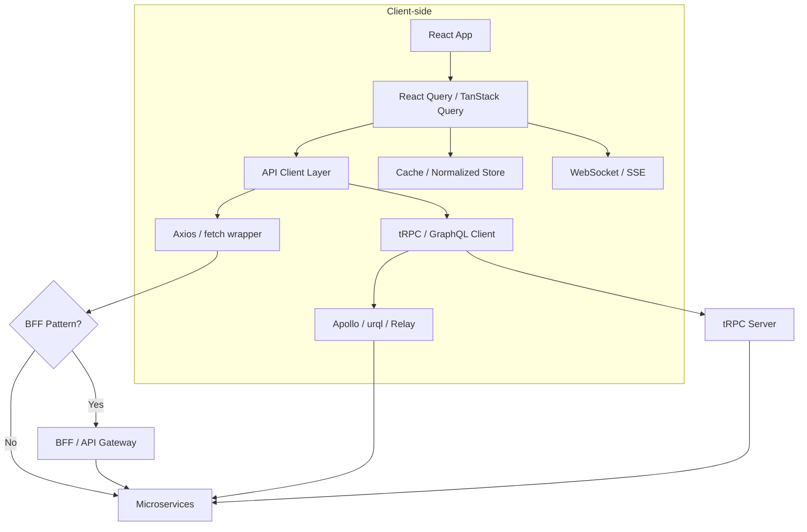

# Frontend API Layer Architecture

## Architecture at a Glance



## What is it?

The frontend API layer is the abstraction between UI components and backend services. It handles data fetching, caching, state synchronization, error handling, request deduplication, and type safety. Modern approaches include GraphQL clients (Apollo Client, urql, Relay), tRPC for full-stack TypeScript, and TanStack Query for server-state management.

## Why it was created

Frontend applications grew from simple pages fetching HTML to complex SPAs managing server state. Without a dedicated API layer, code becomes riddled with `useEffect` + `fetch` calls — leading to race conditions, duplicated requests, stale data, and poor user experience. The API layer centralizes caching, retries, pagination, and optimistic updates.

## When to use it

- Any app with server-state dependencies beyond trivial CRUD
- Apps needing caching, deduplication, or background refetching
- Full-stack TypeScript projects wanting end-to-end type safety (tRPC)
- Applications with complex data graphs requiring selective fetching (GraphQL)
- Real-time or collaborative features requiring optimistic updates

## Hands-on Example: React Query with Optimistic Updates + Infinite Scroll

```tsx
import { useInfiniteQuery, useMutation, useQueryClient } from '@tanstack/react-query';

// --- Infinite Scroll ---
const fetchPosts = async ({ pageParam = 1 }) => {
  const res = await fetch(`/api/posts?page=${pageParam}&limit=10`);
  return res.json();
};

function PostList() {
  const {
    data,
    fetchNextPage,
    hasNextPage,
    isFetchingNextPage,
  } = useInfiniteQuery({
    queryKey: ['posts'],
    queryFn: fetchPosts,
    getNextPageParam: (lastPage) => lastPage.nextPage ?? undefined,
  });

  return (
    <div>
      {data?.pages.map((page) =>
        page.posts.map((post) => <PostCard key={post.id} post={post} />)
      )}
      <button
        onClick={() => fetchNextPage()}
        disabled={!hasNextPage || isFetchingNextPage}
      >
        {isFetchingNextPage ? 'Loading...' : hasNextPage ? 'Load More' : 'No more'}
      </button>
    </div>
  );
}

// --- Optimistic Updates ---
function useLikeMutation() {
  const queryClient = useQueryClient();

  return useMutation({
    mutationFn: async ({ postId }: { postId: string }) => {
      const res = await fetch(`/api/posts/${postId}/like`, { method: 'POST' });
      if (!res.ok) throw new Error('Failed to like');
      return res.json();
    },
    onMutate: async ({ postId }) => {
      await queryClient.cancelQueries({ queryKey: ['posts'] });
      const previous = queryClient.getQueryData(['posts']);
      queryClient.setQueryData(['posts'], (old: any) => {
        if (!old) return old;
        return {
          ...old,
          pages: old.pages.map((page: any) => ({
            ...page,
            posts: page.posts.map((post: any) =>
              post.id === postId
                ? { ...post, likes: post.likes + 1, isLiked: true }
                : post
            ),
          })),
        };
      });
      return { previous };
    },
    onError: (_err, _vars, context) => {
      queryClient.setQueryData(['posts'], context?.previous);
    },
    onSettled: () => {
      queryClient.invalidateQueries({ queryKey: ['posts'] });
    },
  });
}
```

## Best Practices

- Use a dedicated server-state library (React Query, SWR) — don't hand-roll fetch + cache
- Implement request deduplication to avoid duplicate network calls for the same resource
- Adopt the BFF (Backend-for-Frontend) pattern to aggregate and tailor data per client
- Normalize cached data (or use Apollo's `InMemoryCache`) to avoid inconsistencies
- Add retry-with-backoff logic in your API client layer (Axios interceptors)
- Wrap all external API calls in a typed client layer to isolate changes
- Use `staleWhileRevalidate` semantics for perceived performance
- Implement optimistic updates for any mutation the user expects immediate feedback on

## Interview Questions

**Q1: Explain the BFF (Backend-for-Frontend) pattern and when you'd use it.**
A: BFF is a dedicated backend layer that serves a specific frontend client (e.g., mobile vs web). Instead of having your SPA call 10 microservices directly, a BFF aggregates data, trims payloads to what the UI needs, and handles authentication/formatting. It's especially useful when you have multiple client types with different data requirements or when microservice response shapes are not directly usable by the UI. The tradeoff is added maintenance of another service and potential latency from the extra hop.

**Q2: How does TanStack Query handle caching and when does it refetch?**
A: TanStack Query caches by `queryKey` (a serializable array). Data is considered `stale` after `staleTime` (default 0). Refetch triggers include: component remount, window refocus, network reconnection, or manual `invalidateQueries`. It uses a stale-while-revalidate strategy: serves cached data immediately while refetching in background. Cache entries are garbage-collected after `gcTime` (default 5 min) if no active observers exist.

**Q3: Compare Apollo Client, urql, and Relay for GraphQL frontends.**
A: Apollo Client is the most popular, with a rich ecosystem, normalized cache via `InMemoryCache`, and good devtools. It's flexible but heavier. urql is lighter and more modular — you compose "exchanges" (middleware) to add features, making it tree-shakeable. Relay, built by Meta, requires a compiler step and is opinionated about data requirements per component. It excels at performance — fragment co-location, precise re-renders, and pagination — but has a steeper learning curve. Choose Apollo for general use, urql for bundle-conscious apps, and Relay for large-scale Meta-like apps.

## Real Company Usage

| Company | Tech Stack | API Layer Approach |
|---------|-----------|-------------------|
| Meta (Facebook) | React + Relay + GraphQL | Relay with fragment co-location, persisted queries |
| GitHub | React + Apollo Client + GraphQL | Normalized cache with pagination, BFF for REST fallback |
| Vercel | Next.js + tRPC + React Query | End-to-end type safety with tRPC, React Query for caching |
| Twitter/X | React + GraphQL + custom cache layer | Homegrown BFF + real-time streaming, stale-while-revalidate |
