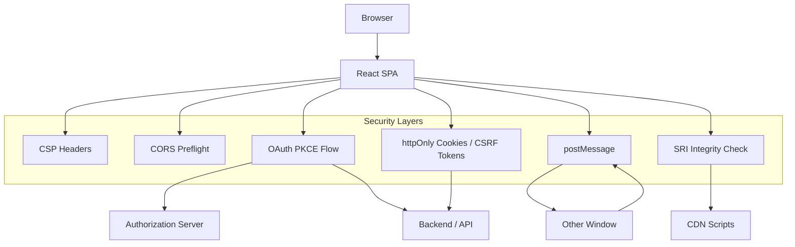

# Frontend Security

## Architecture at a Glance



## What is it?

Frontend security encompasses the techniques and policies that protect client-side applications from attacks such as Cross-Site Scripting (XSS), Cross-Site Request Forgery (CSRF), data injection, token theft, and supply-chain attacks. It includes Content Security Policy (CSP), CORS configuration, secure token handling via OAuth PKCE, postMessage origin validation, and Subresource Integrity (SRI).

## Why it was created

As SPAs moved more logic to the client, attack surfaces grew. Traditional server-rendered apps could rely on server-side sanitization, but SPAs execute user-influenced code in the browser. XSS, CSRF, and token interception became critical threats. A standardized set of browser-native security primitives (CSP, CORS, SameSite cookies, SRI) was needed to give developers tools to defend against these attacks.

## When to use it

- Every web application handling user data or authentication
- SPAs using OAuth (mandatory: PKCE flow for public clients)
- Apps embedding third-party scripts or using CDNs (must use SRI)
- Applications using iframes or cross-origin communication (postMessage)
- Any app with user-generated content rendered in the UI
- APIs serving resources to specific origins only (CORS)

## Hands-on Example: CSP with Nonce + OAuth PKCE Flow in React SPA

### CSP with Nonce (server-side middleware example)

```ts
// Express middleware setting strict CSP with nonce
import crypto from 'node:crypto';
import helmet from 'helmet';

app.use((req, res, next) => {
  res.locals.nonce = crypto.randomBytes(16).toString('base64');
  next();
});

app.use(
  helmet.contentSecurityPolicy({
    directives: {
      defaultSrc: ["'self'"],
      scriptSrc: [
        "'self'",
        (req, res) => `'nonce-${res.locals.nonce}'`,
        // Only allow inline scripts with the nonce
      ],
      styleSrc: ["'self'", "'unsafe-inline'"],
      imgSrc: ["'self'", 'data:', 'https:'],
      connectSrc: ["'self'", 'https://api.example.com'],
      fontSrc: ["'self'", 'https://fonts.gstatic.com'],
      objectSrc: ["'none'"],
      frameAncestors: ["'none'"],
      reportUri: '/csp-report',
    },
    reportOnly: false,
  })
);
```

```tsx
// React: inject nonce into script tags via dangerouslySetInnerHTML
// (the nonce comes from the server-rendered HTML)
function App({ nonce }: { nonce: string }) {
  return (
    <html>
      <head>
        <script nonce={nonce} src="/static/main.js" />
        <script nonce={nonce}>{`initApp();`}</script>
      </head>
      <body>
        <div id="root" />
      </body>
    </html>
  );
}
```

### OAuth PKCE Flow in a React SPA

```tsx
// Step 1: Generate code verifier + challenge
function base64URLEncode(buffer: ArrayBuffer): string {
  return btoa(String.fromCharCode(...new Uint8Array(buffer)))
    .replace(/\+/g, '-')
    .replace(/\//g, '_')
    .replace(/=+$/, '');
}

async function generatePKCEPair() {
  const verifier = base64URLEncode(crypto.getRandomValues(new Uint8Array(32)));
  const challenge = base64URLEncode(
    await crypto.subtle.digest('SHA-256', new TextEncoder().encode(verifier))
  );
  return { verifier, challenge };
}

// Step 2: Redirect to authorization server
async function login() {
  const { verifier, challenge } = await generatePKCEPair();
  // Store verifier in sessionStorage (deleted when tab closes)
  sessionStorage.setItem('pkce_verifier', verifier);

  const params = new URLSearchParams({
    response_type: 'code',
    client_id: process.env.REACT_APP_CLIENT_ID!,
    redirect_uri: `${window.location.origin}/callback`,
    code_challenge: challenge,
    code_challenge_method: 'S256',
    scope: 'openid profile email',
  });
  window.location.href = `https://auth.example.com/authorize?${params}`;
}

// Step 3: Handle callback — exchange code for tokens
async function handleCallback(code: string) {
  const verifier = sessionStorage.getItem('pkce_verifier');
  if (!verifier) throw new Error('No PKCE verifier found');

  const res = await fetch('https://auth.example.com/token', {
    method: 'POST',
    headers: { 'Content-Type': 'application/x-www-form-urlencoded' },
    body: new URLSearchParams({
      grant_type: 'authorization_code',
      code,
      redirect_uri: `${window.location.origin}/callback`,
      client_id: process.env.REACT_APP_CLIENT_ID!,
      code_verifier: verifier,
    }),
  });

  const tokens = await res.json();
  sessionStorage.removeItem('pkce_verifier');
  // Store access token in memory (never localStorage for SPAs)
  // Use httpOnly cookie for refresh token via backend proxy
  return tokens;
}
```

## Best Practices

- Set a strict CSP with nonce or hash-based script loading — avoid `'unsafe-inline'`
- Use `httpOnly` + `SameSite=Strict` cookies for session tokens; never store access tokens in `localStorage`
- Implement PKCE for every OAuth flow in SPAs — never use the implicit grant
- Validate `event.origin` and use `targetOrigin` in every `postMessage` call
- Add `integrity` attributes to all CDN-sourced `<script>` and `<link>` tags (SRI)
- Configure CORS to allow only specific origins, methods, and headers — never `Access-Control-Allow-Origin: *` with credentials
- Sanitize all user-generated content with DOMPurify before rendering via `dangerouslySetInnerHTML`
- Report CSP violations via `report-uri` or `report-to` to detect attacks early
- Implement refresh token rotation to limit the window of compromised tokens

## Interview Questions

**Q1: Explain the difference between XSS and CSRF and how to mitigate each.**
A: XSS (Cross-Site Scripting) is injecting malicious scripts into a trusted website, executed in the victim's browser. It's mitigated by CSP (restricting script sources), output encoding, input sanitization (DOMPurify), and avoiding dangerous APIs like `innerHTML`. CSRF (Cross-Site Request Forgery) tricks the user's browser into making unwanted requests to an authenticated site. It's mitigated by SameSite cookies (Strict/Lax), anti-CSRF tokens (double-submit cookie pattern or server-issued token), and custom request headers (e.g., `X-Requested-By`). XSS attacks the user's trust in the site; CSRF attacks the site's trust in the user's browser.

**Q2: Why is localStorage dangerous for storing OAuth tokens, and what is the alternative?**
A: localStorage is accessible to any JavaScript running in the same origin, meaning a single XSS vulnerability can leak all tokens. There is no way to mark localStorage as httpOnly. The alternatives are: (1) Store tokens in memory (JS variable) — lost on page refresh, requiring refresh token rotation. (2) Use httpOnly cookies set by a backend proxy — the JS never sees the token, and cookies can have SameSite+Secure flags. The recommended pattern for SPAs is a backend-for-frontend (BFF) that issues httpOnly session cookies after the OAuth flow, keeping the actual tokens server-side.

**Q3: Walk through how a strict CSP with nonces prevents both reflected and stored XSS.**
A: A strict CSP with nonces tells the browser: "only execute `<script>` tags whose `nonce` attribute matches the one generated server-side for this request." Any injected script (reflected in URL params or stored in a database) will lack the valid nonce and the browser refuses to execute it. Combined with `default-src 'self'` and restricting `connect-src`, even if an attacker injects HTML, they cannot load external scripts, make fetch requests to a C2 server, or inline code. Report-only mode (`Content-Security-Policy-Report-Only`) allows testing without enforcement by sending violation reports to the `report-uri` endpoint.

## Real Company Usage

| Company | Security Practices |
|---------|-------------------|
| GitHub | Strict CSP with nonces, DOMPurify for user content, httpOnly cookies for sessions, CORS allowlist for API |
| Stripe | PKCE for OAuth, SRI on all SDK scripts, strict CSP, postMessage origin validation in payment iframes |
| Google (Gmail) | Extreme CSP with strict allowlists, token binding, isolated iframes for attachments, XSS protection via output encoding at every layer |
| Slack | CSP with nonce for desktop/web, postMessage validation for embedded apps, CSRF tokens per session |
