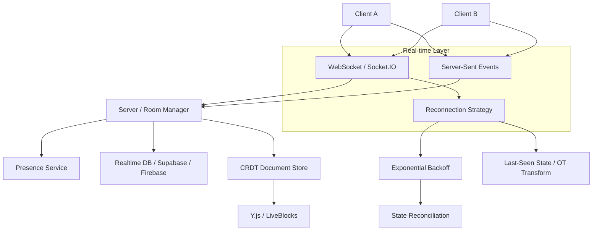

# Real-Time Frontend Patterns

## Architecture at a Glance



## What is it?

Real-time frontend patterns enable live, bidirectional data flow between clients and servers (or between peers). Technologies include WebSockets (persistent TCP connections), Server-Sent Events (HTTP push from server to client), CRDTs and Operational Transform (OT) for collaborative editing, and real-time data sync services like Supabase Realtime, Firebase, and LiveBlocks. Core concerns are reconnection strategies, conflict resolution, presence tracking, and optimistic updates.

## Why it was created

The HTTP request-response model is fundamentally pull-based — clients must poll to see changes. Real-time features (chat, live cursors, collaborative documents, notifications, live dashboards) require sub-second updates without polling overhead. WebSockets provided full-duplex persistent connections, SSE offered simpler server-to-client streaming, and CRDTs/OT solved the hard problem of concurrent edits without a central lock.

## When to use it

- Chat applications and messaging platforms
- Collaborative document editing (Google Docs-style)
- Live cursors and presence indicators
- Real-time dashboards (metrics, monitoring)
- Multiplayer games and interactive whiteboards
- Live notifications and activity feeds
- Streaming data (financial tickers, sports scores)

## Hands-on Example: WebSocket Chat with Reconnection + Socket.IO Rooms

```tsx
import { useEffect, useState } from 'react';
import { io, Socket } from 'socket.io-client';

// --- Server (Node.js) ---
// import { Server } from 'socket.io';
// const io = new Server(httpServer, { cors: { origin: '*' } });
// io.on('connection', (socket) => {
//   socket.on('join_room', (room) => socket.join(room));
//   socket.on('chat_message', ({ room, msg }) => {
//     io.to(room).emit('chat_message', { user: socket.id, msg });
//   });
// });

// --- Client ---
function useSocket(url: string) {
  const [socket, setSocket] = useState<Socket | null>(null);

  useEffect(() => {
    const s = io(url, {
      transports: ['websocket'],
      reconnection: true,
      reconnectionAttempts: Infinity,
      reconnectionDelay: 1000,
      reconnectionDelayMax: 30000,
      randomizationFactor: 0.5,
    });

    s.on('connect', () => console.log('Connected:', s.id));
    s.on('disconnect', (reason) => {
      if (reason === 'io server disconnect') {
        // manual disconnect — don't reconnect
      }
      // else — auto-reconnect with backoff
    });
    s.on('connect_error', (err) => console.error('Connection error:', err.message));

    setSocket(s);
    return () => { s.disconnect(); };
  }, [url]);

  return socket;
}

function ChatRoom({ room }: { room: string }) {
  const socket = useSocket('http://localhost:3001');
  const [messages, setMessages] = useState<{ user: string; msg: string }[]>([]);
  const [input, setInput] = useState('');

  useEffect(() => {
    if (!socket) return;
    socket.emit('join_room', room);
    socket.on('chat_message', (data) => {
      setMessages((prev) => [...prev, data]);
    });
    return () => { socket.emit('leave_room', room); };
  }, [socket, room]);

  const send = () => {
    if (!input.trim() || !socket) return;
    socket.emit('chat_message', { room, msg: input });
    setInput('');
  };

  return (
    <div>
      <div>
        {messages.map((m, i) => (
          <p key={i}><strong>{m.user}:</strong> {m.msg}</p>
        ))}
      </div>
      <input value={input} onChange={(e) => setInput(e.target.value)} onKeyDown={(e) => e.key === 'Enter' && send()} />
      <button onClick={send}>Send</button>
    </div>
  );
}
```

### Real-time Collaboration with LiveBlocks / CRDT

```tsx
import { createClient, LiveObject } from '@liveblocks/client';
import { useMutation, useStorage } from '@liveblocks/react';

// Client setup
const client = createClient({
  authEndpoint: '/api/liveblocks-auth',
  // Resolve conflicts automatically via CRDT
});

function CollaborativeEditor({ roomId }: { roomId: string }) {
  return (
    <RoomProvider id={roomId} initialPresence={{ cursor: null }}>
      <Canvas />
    </RoomProvider>
  );
}

function Canvas() {
  const shapes = useStorage((root) => root.shapes);

  const addShape = useMutation(
    ({ storage }, shape: { x: number; y: number; color: string }) => {
      const shapes = storage.get('shapes');
      shapes.push(new LiveObject(shape));
    },
    []
  );

  return (
    <div>
      {shapes?.map((shape, i) => (
        <div key={i} style={{ left: shape.x, top: shape.y, background: shape.color }} />
      ))}
      <button onClick={() => addShape({ x: 100, y: 100, color: 'red' })}>Add Shape</button>
    </div>
  );
}
```

## Best Practices

- Implement exponential backoff with jitter for WebSocket reconnections — never reconnect linearly
- Persist last-known state locally and reconcile on reconnect to avoid data loss
- Use CRDTs (Y.js, LiveBlocks) for conflict-free collaborative editing instead of OT — CRDTs are simpler to reason about at scale
- Track connection quality — degrade gracefully (e.g., hide cursor positions on slow connections)
- Always validate origin/authentication on WebSocket upgrade; never trust the client
- Use rooms/channels to scope real-time events and avoid broadcasting to all clients
- Batch real-time events where possible to reduce overhead (e.g., buffer cursor updates per 50ms)

## Interview Questions

**Q1: Compare WebSockets and Server-Sent Events (SSE) for real-time frontends.**
A: WebSockets provide full-duplex communication over a single TCP connection — both client and server can push messages at any time. SSE is unidirectional: server pushes events to the client over HTTP. SSE is simpler (native `EventSource` API), auto-reconnects, and works through most HTTP proxies, but only supports text data and a limited number of concurrent connections per browser (typically 6). WebSockets are better for bidirectional chat, gaming, and collaborative editing. SSE is ideal for live feeds, notifications, and dashboards where only the server pushes data. For maximum compatibility, use WebSockets with an SSE fallback.

**Q2: How do CRDTs solve conflict resolution in collaborative editing?**
A: CRDTs (Conflict-free Replicated Data Types) allow multiple clients to edit the same data concurrently without a central coordinator. Each change is assigned a unique ID (e.g., a Lamport timestamp + replica ID). When two clients make conflicting edits, CRDTs use a deterministic merge strategy — typically Last-Writer-Wins (LWW) for scalar values or a sequence CRDT (like YATA in Y.js) for ordered lists. Because the merge is commutative, associative, and idempotent, all replicas converge to the same state after synchronizing, without conflicts requiring resolution. This eliminates the need for operational transforms (OT), which require a central server and careful ordering.

**Q3: Describe a robust reconnection strategy for a real-time WebSocket application.**
A: A robust strategy includes: (1) Exponential backoff — start with 1s delay, double each attempt up to a cap (e.g., 30s), with random jitter (±50%) to avoid thundering herd. (2) Reconnect state reconciliation — on reconnect, send the last known version/sequence number to the server, which replays missed events. (3) Idempotent messages — assign each message a client-generated ID so the server deduplicates. (4) Connection health monitoring — ping/pong frames to detect dead connections. (5) Graceful degradation — show a "Reconnecting..." UI, buffer outgoing messages during outage, and flush them on reconnect.

## Real Company Usage

| Company | Real-time Tech | Use Case |
|---------|---------------|----------|
| Google (Docs) | OT (Operational Transform) + WebSocket | Collaborative document editing at scale |
| Figma | WebSocket + CRDT (own implementation) | Multiplayer design collaboration, live cursors |
| Slack | Socket.IO (WebSocket + long-polling fallback) | Real-time messaging, presence, typing indicators |
| Trello | WebSocket + SSE fallback | Real-time board/card updates across clients |
