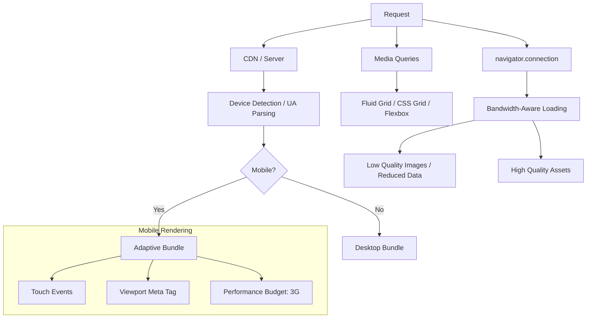

# Mobile Web Architecture

## Architecture at a Glance



## What is it?

Mobile web architecture covers responsive design (fluid grids, flexible images, CSS media queries), mobile-first development, touch event handling, adaptive loading based on device capability and network conditions, and performance optimization for constrained devices. It includes viewport management, eliminating the 300ms tap delay, and strategies like AMP for accelerated rendering.

## Why it was created

Mobile web traffic surpassed desktop in 2016/2017. Users on 3G connections with low-end phones expected fast, usable experiences. Developers needed systematic approaches to handle variable screen sizes, touch interfaces, limited bandwidth, and constrained CPUs. Responsive design eliminated the need for separate m. sites, while mobile-first forced teams to prioritize performance and core content.

## When to use it

- Every web application that targets mobile or tablet users (nearly all consumer apps)
- Progressive Web Apps (PWAs) that install on mobile home screens
- E-commerce sites where mobile conversion rates are critical
- Emerging markets where low-end devices and 2G/3G connections dominate
- Content-heavy sites where load time directly impacts user retention (news, social feeds)

## Hands-on Example: Responsive React App with Adaptive Loading

```tsx
import { useState, useEffect, useCallback } from 'react';

// --- Adaptive Loading Hook ---
type ConnectionType = 'slow-2g' | '2g' | '3g' | '4g' | '5g' | 'unknown';

interface NetworkInfo {
  effectiveType: ConnectionType;
  downlink: number;  // Mbps
  rtt: number;       // ms
  saveData: boolean;
}

function useNetworkStatus(): NetworkInfo {
  const [info, setInfo] = useState<NetworkInfo>(() => {
    const conn = (navigator as any).connection;
    return {
      effectiveType: conn?.effectiveType ?? 'unknown',
      downlink: conn?.downlink ?? 0,
      rtt: conn?.rtt ?? 0,
      saveData: conn?.saveData ?? false,
    };
  });

  useEffect(() => {
    const conn = (navigator as any).connection;
    if (!conn) return;

    const onChange = () => {
      setInfo({
        effectiveType: conn.effectiveType,
        downlink: conn.downlink,
        rtt: conn.rtt,
        saveData: conn.saveData,
      });
    };

    conn.addEventListener('change', onChange);
    return () => conn.removeEventListener('change', onChange);
  }, []);

  return info;
}

// --- Image Component with Adaptive Quality ---
function AdaptiveImage({ src, alt, lowResSrc }: { src: string; alt: string; lowResSrc: string }) {
  const { effectiveType } = useNetworkStatus();
  const isLowConnection = effectiveType === 'slow-2g' || effectiveType === '2g' || effectiveType === '3g';

  return (
    <picture>
      <source
        srcSet={isLowConnection ? lowResSrc : src}
        media="(-webkit-min-device-pixel-ratio: 1)"
      />
      
    </picture>
  );
}

// --- Responsive Layout with CSS Grid ---
// CSS:
// .grid { display: grid; grid-template-columns: repeat(auto-fit, minmax(280px, 1fr)); gap: 1rem; }
// @media (max-width: 600px) { .grid { grid-template-columns: 1fr; } }

function ProductGrid() {
  return (
    <div className="grid">
      <ProductCard />
      <ProductCard />
      <ProductCard />
    </div>
  );
}

// --- Touch vs Click ---
function TouchAwareButton({ onAction }: { onAction: () => void }) {
  const handleTouch = useCallback((e: React.TouchEvent) => {
    e.preventDefault();  // prevent 300ms delay
    onAction();
  }, [onAction]);

  return (
    <button
      onTouchStart={handleTouch}
      onClick={onAction}
      style={{ touchAction: 'manipulation' }}
    >
      Tap me
    </button>
  );
}
```

### Viewport Configuration

```html
<!-- Essential meta tag for responsive mobile web -->
<meta name="viewport" content="width=device-width, initial-scale=1.0, maximum-scale=1.0, user-scalable=no" />
```

### Performance Budget Example

```json
{
  "performanceBudget": {
    "3GFirstLoad": {
      "timeToInteractive": 5000,
      "bundleSize": 170000,
      "totalTransferSize": 500000,
      "maxServerResponses": 25
    },
    "4GFirstLoad": {
      "timeToInteractive": 3000,
      "bundleSize": 250000,
      "totalTransferSize": 1000000
    }
  }
}
```

## Best Practices

- Design mobile-first — start with the smallest screen and progressively enhance
- Use `touchAction: manipulation` on interactive elements to eliminate the 300ms tap delay
- Add passive touch listeners (`{ passive: true }`) for scroll performance — never call `preventDefault()` in a touchmove listener unless necessary
- Leverage `navigator.connection` for bandwidth-aware loading: serve low-res images/videos on slow connections
- Set a performance budget (e.g., <170KB JS for 3G TTI under 5s) and enforce via CI
- Use CSS media queries — prefer `min-width` queries for mobile-first; test on real devices, not just DevTools
- Lazy-load below-fold images with `loading="lazy"` and consider `IntersectionObserver` for advanced cases
- Avoid AMP unless you need Google's Top Stories placement — its constraints (no custom JS, cached-by-proxy) limit functionality and ownership

## Interview Questions

**Q1: Explain the 300ms tap delay on mobile — why did it exist and how do you fix it?**
A: The 300ms delay existed because mobile browsers waited to distinguish between a tap (single click) and a double-tap (zoom gesture). In 2016, browsers began eliminating it for pages with the `width=device-width` viewport meta tag (which implies the page is mobile-optimized and zoom isn't needed). To fix it: (1) Use `<meta name="viewport" content="width=device-width">` — modern Chrome and Safari remove the delay automatically. (2) Set `touch-action: manipulation` CSS on interactive elements. (3) For older browsers, use libraries like FastClick (though mostly unnecessary today). (4) Use `onTouchStart` instead of `onClick` for critical interactions, but still support click as fallback.

**Q2: How would you architect a mobile web app for users in emerging markets with 2G/3G connections?**
A: (1) Set a strict performance budget — <100KB critical JS, <300KB total page weight. (2) Use `navigator.connection` to detect `effectiveType` and `saveData` flag — serve text-only or low-res versions on 2G. (3) Implement progressive enhancement — fully functional HTML/CSS with no JS, then enhance. (4) Use service worker to cache core assets on first visit (offline-first). (5) Code-split aggressively with React.lazy and load non-critical chunks on interaction. (6) Optimize images with WebP/AVIF and serve via `<picture>` with resolution switching. (7) Use Critical CSS inlining and defer non-critical styles.

**Q3: Compare AMP (Accelerated Mobile Pages) with a well-optimized responsive PWA.**
A: AMP is a restricted HTML framework enforced by a cache (Google's AMP Cache). Pages load near-instantly because custom JS is banned, CSS is limited (75KB), and resources are preloaded. Trade-offs: you cannot use your own framework (React/Vue), analytics are limited, and your content lives on Google's domain. A well-optimized PWA with code-splitting, service worker caching, critical CSS inlining, and lazy loading can match AMP's performance without losing control. AMP is mainly useful for publishers who want Google Top Stories carousel placement. For most apps, a PWA with a strict performance budget is preferred — it gives full control and the same performance wins.

## Real Company Usage

| Company | Mobile Strategy | Key Techniques |
|---------|----------------|----------------|
| Twitter/X | PWA + Adaptive Loading | Reduced data mode, lazy images, service worker cache, mobile-first CSS |
| Medium | Responsive PWA | Critical CSS inline, font loading strategy, adaptive image serving |
| Flipkart | Lite app (PWA) with adaptive loading | 3G detection, reduced bundle (200KB), offline cart, push notifications |
| Google | AMP for News/Top Stories | Restricted HTML, pre-rendered via AMP Cache, instant load on mobile |
