# Frontend System Design Interview Examples

## Architecture at a Glance

```mermaid
graph TD
    subgraph "Real-Time Collaborative Editor"
        A1[Client] --> B1[Y.js CRDT]
        B1 --> C1[WebSocket Sync Server]
        C1 --> D1[Document Store]
        A1 --> E1[OT Transform]
        A1 --> F1[Presence / Cursors]
    end
    subgraph "Video Streaming UI"
        A2[Client] --> B2[Virtual Scroller]
        A2 --> C2[Adaptive Bitrate ABR]
        C2 --> D2[Media Source Extensions]
        A2 --> E2[Service Worker Cache]
        E2 --> F2[CDN / HLS Segments]
    end
    subgraph "Social Media Feed"
        A3[Client] --> B3[Infinite Scroll]
        A3 --> C3[Real-time Updates / SSE]
        A3 --> D3[Optimistic UI]
        D3 --> E3[Image Optimization]
        A3 --> F3[Notification System]
    end
    subgraph "Data Dashboard"
        A4[Client] --> B4[Widget System]
        B4 --> C4[Real-time Stream]
        A4 --> D4[Filter / Date Range]
        A4 --> E4[Export / CSV]
    end
    subgraph "Design System at Scale"
        A5[Design Tokens] --> B5[Component Library]
        B5 --> C5[Storybook]
        B5 --> D5[Theme Provider]
        B5 --> E5[Accessibility / a11y]
        B5 --> F5[NPM Package Registry]
    end
```



## 1. Design a Real-Time Collaborative Document Editor

**Requirements:** Google Docs-style editing, multiple users editing simultaneously, see others' cursors, offline support.

**Architecture:**

- **CRDT (Y.js)** — each character is a Y.Text element with unique ID. No central conflict resolution needed; merge is deterministic.
- **WebSocket sync server** — Y.js provides a websocket provider that syncs document state between peers via a central relay server (or peer-to-peer via WebRTC).
- **OT for undo/redo** — operational transform tracks the history stack locally; undo is transformed against remote ops.
- **Presence** — broadcast cursor position (x, y, selection range) via WebSocket at ~30fps, throttled with requestAnimationFrame.
- **Offline** — Y.js updates are applied to an in-memory document. On reconnect, sync protocol exchanges only missing operations (state vector diff).
- **Scaling** — use rooms per document. The sync server can be stateless if document state is persisted to S3/Redis. For very large docs, use OT with a canonical server (Google Docs approach) instead of P2P CRDT.

**Key Trade-off:** CRDTs simplify conflict resolution but produce metadata overhead (each character has an ID). For documents with millions of characters, a CRDT-based approach needs compaction (GC of deleted character metadata).

```ts
// Core CRDT with Y.js
import * as Y from 'yjs';
import { WebsocketProvider } from 'y-websocket';

const doc = new Y.Doc();
const provider = new WebsocketProvider('ws://localhost:1234', 'room-1', doc);
const text = doc.getText('content');

// Listen for remote changes
text.observe((event) => {
  // Update local editor view
});

// Insert local text
text.insert(0, 'Hello, world!');

// Track presence
const awareness = provider.awareness;
awareness.setLocalState({ cursor: { x: 10, y: 20 } });
```

## 2. Design a Video Streaming UI (YouTube/Netflix)

**Requirements:** Virtual scrolling for thousands of videos, adaptive bitrate for varying connections, offline watch via service worker, instant search.

**Architecture:**

- **Virtual scroller (react-window)** — render only visible rows + overscan. Fixed dimensions for thumbnails to avoid layout shift.
- **Adaptive Bitrate (ABR)** — HLS/DASH segments. Client monitors buffer health + throughput and requests next segment at appropriate quality. Use `Media Source Extensions` + `hls.js`.
- **Service worker** — cache video metadata, thumbnails, and UI shell. For offline, cache segments via Workbox range requests. Use `Cache-Control: immutable` for segments.
- **Search** — debounced input → Algolia/Elasticsearch. Instant results with optimistic local cache.
- **Image optimization** — use `<picture>` with AVIF/WebP fallback. Blur hash placeholder until thumbnail loads.
- **Performance** — lazy load video list with IntersectionObserver. Preload next video's metadata and first segment when user hovers.

```tsx
// Virtual scroller with react-window
import { FixedSizeList as List } from 'react-window';

function VideoGrid({ videos }: { videos: Video[] }) {
  return (
    <List height={800} itemCount={videos.length} itemSize={200} width="100%">
      {({ index, style }) => (
        <div style={style}>
          <VideoCard video={videos[index]} />
        </div>
      )}
    </List>
  );
}

// Adaptive Bitrate with hls.js
import Hls from 'hls.js';

function VideoPlayer({ src }: { src: string }) {
  const videoRef = useRef<HTMLVideoElement>(null);
  useEffect(() => {
    if (Hls.isSupported()) {
      const hls = new Hls({
        enableWorker: true,
        startLevel: 2, // start at medium quality
        abrEwmaDefaultEstimate: 500000, // 500kbps
      });
      hls.loadSource(src);
      hls.attachMedia(videoRef.current!);
      hls.on(Hls.Events.LEVEL_SWITCHED, (_event, data) => {
        console.log('Quality switched to:', data.level);
      });
      return () => hls.destroy();
    }
  }, [src]);

  return <video ref={videoRef} controls />;
}
```

## 3. Design a Social Media Feed (Twitter/Instagram)

**Requirements:** Infinite scroll with pagination, real-time updates, optimistic like/follow, image optimization, notification system.

**Architecture:**

- **Infinite scroll** — IntersectionObserver triggers `fetchNextPage` from React Query. Cache feed pages with `staleTime: 30s`.
- **Real-time updates** — SSE (EventSource) for new posts. Incoming posts are prepended to feed via `queryClient.setQueryData`.
- **Optimistic UI** — like/follow mutations update cache immediately; rollback on error.
- **Image optimization** — responsive srcset with WebP/AVIF. Progressive JPEG for slow connections. Blurhash placeholder.
- **Notification system** — WebSocket or SSE for real-time alerts. Service worker push notifications for background.
- **Tweet detail** — when navigating to a tweet, use React Query's `initialData` from feed cache to show instant UI.

```tsx
// Optimistic Like with React Query
function useLike() {
  const qc = useQueryClient();
  return useMutation({
    mutationFn: (postId: string) => fetch(`/api/posts/${postId}/like`, { method: 'POST' }),
    onMutate: async (postId) => {
      await qc.cancelQueries({ queryKey: ['feed'] });
      const previous = qc.getQueryData(['feed']);
      qc.setQueryData(['feed'], (old: any) =>
        old?.pages.map((page: any) => ({
          ...page,
          posts: page.posts.map((p: any) => p.id === postId ? { ...p, liked: true, likes: p.likes + 1 } : p),
        }))
      );
      return { previous };
    },
    onError: (_err, _id, context) => qc.setQueryData(['feed'], context?.previous),
    onSettled: () => qc.invalidateQueries({ queryKey: ['feed'] }),
  });
}
```

## 4. Design a Data Dashboard

**Requirements:** Drag-and-drop widgets, real-time data streams, date range filter, CSV/PDF export, responsive for mobile.

**Architecture:**

- **Widget system** — each widget is a Lazy-loaded React component registered in a registry. Layout uses `react-grid-layout` for drag/resize. Widget state persisted to localStorage + backend.
- **Real-time streams** — WebSocket or SSE per widget. Each widget subscribes to its data topic. Connection coalesced via a shared real-time client.
- **Filter system** — date range picker + dimensions. Filters are lifted to a global context. Widgets recompute via debounced API calls (with previous data shown as stale while refetching).
- **Export** — client generates CSV in memory via `Blob`. PDF uses `@react-pdf/renderer` or server-side headless Chrome render.
- **Performance** — virtualize widget grid if many widgets. Waterfall rendering — critical widgets load first. Throttle real-time updates to max 1/second for non-critical metrics.
- **Caching** — React Query for API data. Dashboard-level cache keyed by filter hash.

```tsx
// Widget registry pattern
const WIDGET_REGISTRY = {
  lineChart: lazy(() => import('./widgets/LineChart')),
  barChart: lazy(() => import('./widgets/BarChart')),
  table: lazy(() => import('./widgets/DataTable')),
  metric: lazy(() => import('./widgets/MetricCard')),
} as const;

function Dashboard({ layout, widgets }: { layout: Layout[]; widgets: WidgetConfig[] }) {
  return (
    <FilterProvider>
      <GridLayout layout={layout} cols={12} rowHeight={100}>
        {widgets.map((w) => (
          <div key={w.id} data-grid={w.position}>
            <Suspense fallback={<WidgetSkeleton />}>
              {React.createElement(WIDGET_REGISTRY[w.type], w.props)}
            </Suspense>
          </div>
        ))}
      </GridLayout>
    </FilterProvider>
  );
}
```

## 5. Design a Design System at Scale

**Requirements:** Shared component library used across 10+ product teams, theming support, accessibility baked in, Storybook documentation, distributed via private npm.

**Architecture:**

- **Design tokens** — colors, spacing, typography defined in JSON. Build step generates CSS custom properties, JS constants, and theme objects.
- **Component library** — atomic design: atoms (Button, Input) → molecules (FormField) → organisms (DataTable). Each component has:
  - TypeScript types (strict)
  - Accessibility (ARIA attributes, keyboard nav, focus management)
  - Unit tests (Testing Library) + visual regression tests (Chromatic/Percy)
  - Storybook stories for every prop variant
- **Theming** — React Context-based `ThemeProvider`. Each component reads theme from context. Multiple themes (light, dark, high-contrast). Tokens are overridden per theme.
- **Distribution** — private npm package (`@company/ui`). Published via CI with semver. Use `tsup` for build (ESM + CJS). Tree-shakeable with side effect flags.
- **Cross-team** — versioning: each breaking change in minor version with codemods for migration. RFC process for new components. Weekly release cadence.
- **Performance** — avoid `lodash`/large deps. Bundle size tracked with `size-limit`. Each component individually importable.

```tsx
// Theme tokens
const lightTheme = {
  colors: { primary: '#0066FF', background: '#FFFFFF', text: '#111111' },
  spacing: { xs: '4px', sm: '8px', md: '16px', lg: '24px' },
  typography: { fontFamily: 'Inter, sans-serif', fontSize: { body: '16px', h1: '32px' } },
} as const;

// Theme context
const ThemeContext = createContext(lightTheme);

function ThemeProvider({ theme, children }: { theme: typeof lightTheme; children: ReactNode }) {
  // Inject CSS custom properties for non-React consumers
  useEffect(() => {
    const root = document.documentElement;
    Object.entries(theme.colors).forEach(([key, val]) => root.style.setProperty(`--color-${key}`, val));
  }, [theme]);
  return <ThemeContext.Provider value={theme}>{children}</ThemeContext.Provider>;
}

// Accessible Button
function Button({ variant = 'primary', children, ...props }: ButtonProps) {
  const theme = useContext(ThemeContext);
  return (
    <button
      style={{ background: theme.colors[variant], color: '#fff', padding: theme.spacing.md }}
      aria-disabled={props.disabled}
      {...props}
    >
      {children}
    </button>
  );
}
```

## Best Practices

- Start system design interviews by clarifying requirements and gathering constraints before proposing solutions
- Use trade-off analysis — every decision has pros/cons; show you understand both sides
- Draw clear boundaries between client and server responsibilities in your architecture
- Consider edge cases: offline, error states, race conditions, slow networks, accessibility
- State assumptions explicitly (e.g., "I'll assume 10M DAU with 60th-percentile latency target of 200ms")
- Prefer simpler solutions with clear scaling paths over over-engineered initial designs
- For frontend-specific interviews, focus on component architecture, data flow, rendering performance, bundle size, and real-time interactions

## Interview Questions

**Q1: Walk through how you would design the frontend for Google Docs from scratch.**
A: Start with requirements: real-time collaboration, offline editing, rich text formatting, version history. Architecture: (1) CRDT (Y.js) for conflict resolution — each character is a Y.Text node. (2) WebSocket for client-server sync via a central relay (or WebRTC for P2P). (3) OT for undo — local operations are stacked and transformed against incoming remote ops. (4) Rich text — use a custom renderer over ContentEditable or ProseMirror/Slate for fine-grained control. (5) Presence — cursors and selections broadcast at 30fps via WebSocket, throttled. (6) Offline — Y.js stores doc in IndexedDB; sync state vector on reconnect to exchange only missing ops. (7) Scaling — group edits into change batches, persist to a document store (e.g., DynamoDB + S3). For millions of concurrent editors, use a dedicated sync server per document room with horizontal scaling via consistent hashing.

**Q2: How would you implement a Netflix-like video streaming frontend?**
A: (1) Virtual scrolling for catalog with fixed-size card cells (react-window). (2) HLS/DASH with hls.js for adaptive bitrate — monitor buffer health (keep 30s in buffer), switch quality based on throughput. (3) Service worker cache for UI shell + metadata with Cache-First strategy. Video segments cached with Stale-While-Revalidate. (4) Search — Algolia for instant results; debounced input with local cache. (5) Image optimization — AVIF/WebP with blurhash placeholders, responsive srcset. (6) Performance — lazy load below-fold sections with IntersectionObserver; preload next episode's metadata on hover. (7) For live streams, use LL-HLS (Low Latency HLS) with partial segments and WebSocket for manifest updates.

**Q3: Design a scalable design system for a company with 15 frontend teams.**
A: (1) Centralized package — `@company/ui` with atomic components (Button, Input → FormField → DataTable). Each component has TypeScript types, a11y tests, Storybook stories, and visual regression tests (Chromatic). (2) Design tokens as JSON → generates CSS custom properties and JS theme objects. (3) Theming via React Context — multiple themes (light, dark, high-contrast). (4) Distribution — private npm, published via CI with `semver`. Use `tsup` for dual ESM/CJS build with tree-shaking. (5) Versioning — breaking changes = minor version (per semver), with codemods. Weekly releases with changelogs. (6) Governance — RFC process for new components; a dedicated platform team reviews and maintains core; squads contribute via PRs. (7) Prevent fragmentation — use tools like Style Dictionary for tokens, Bundle Analyzer + size-limit CI checks to keep components lean (<2KB each).

## Real Company Usage

| Company | System Design Example | Key Technologies |
|---------|------------------------|-----------------|
| Google | Collaborative Editor (Docs) | OT, WebSocket, ProseMirror, CRDT research |
| Netflix | Video Streaming UI | React, hls.js, Service Worker, AWS Elemental |
| Figma | Real-time Design Collaboration | WebGL, WebSocket, CRDT, custom WebAssembly renderer |
| Uber | Data Dashboard (Uber RIBs) | Micro-frontends, WebSocket, D3.js, real-time geospatial |
| Salesforce | Design System (Lightning) | SLDS design tokens, React, Storybook, Stencil compiler |
