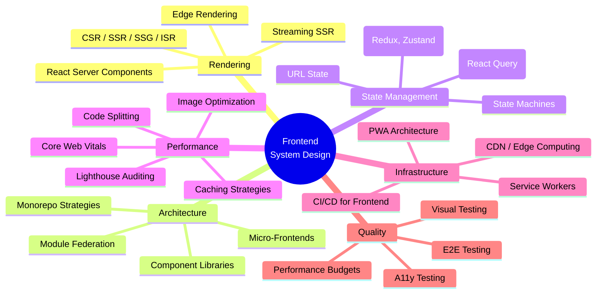

# 27 — Frontend System Design

> Master the architecture, performance, and scalability of modern frontend systems — from rendering patterns and state management to micro-frontends, web performance, and mobile web.

## Module Overview

Frontend System Design covers the architectural decisions behind building fast, scalable, and maintainable web applications. This module spans rendering strategies (CSR, SSR, SSG, ISR), micro-frontend decomposition, state management at scale, web performance optimization, service workers, and testing strategies. Each file includes architecture diagrams, hands-on examples, and real-world patterns.

## Topics

| # | File | Description |
|---|------|-------------|
| 01 | [Rendering Patterns](01-rendering-patterns.md) | CSR, SSR, SSG, ISR, streaming SSR, edge rendering, RSCs |
| 02 | [Micro-Frontends](02-micro-frontends.md) | Module Federation, iframes, web components, decomposition strategies |
| 03 | [State Management](03-state-management.md) | Client, server, URL, and UI state; Zustand, Redux, React Query, XState |
| 04 | [Web Performance](04-web-performance.md) | Core Web Vitals, Lighthouse, RAIL, performance budgets, optimization |
| 05 | [Bundle Optimization](05-bundle-optimization.md) | Code splitting, tree shaking, dynamic imports, module/nomodule |
| 06 | [Caching Strategies](06-caching-strategies.md) | HTTP caching, service workers, CDN, stale-while-revalidate, SWR |
| 07 | [Service Workers & PWA](07-service-workers-pwa.md) | SW lifecycle, cache strategies, offline-first, push notifications, PWA |
| 08 | [CDN & Edge Computing](08-cdn-edge-computing.md) | Cloudflare Workers, Vercel Edge, Fastly, edge rendering and caching |
| 09 | [Monorepo & Component Design](09-monorepo-component-design.md) | Turborepo, Nx, Storybook, design systems, versioning, publishing |
| 10 | [Frontend Testing Strategy](10-frontend-testing-strategy.md) | Unit, integration, E2E, visual, a11y, performance testing strategy |
| 11 | [API Layer Design](11-api-layer-design.md) | GraphQL, tRPC, React Query, SWR, API client architecture, BFF |
| 12 | [Security for Frontends](12-security-frontends.md) | XSS, CSRF, CSP, CORS, postMessage, OAuth PKCE, token storage |
| 13 | [Real-Time Frontends](13-realtime-frontends.md) | WebSockets, SSE, real-time state sync, optimistic updates, collaboration |
| 14 | [Mobile Web & Responsive](14-mobile-web-responsive.md) | Responsive design, mobile-first, AMP, adaptive loading, touch events |
| 15 | [Frontend System Design Examples](15-frontend-system-design-examples.md) | Design a chat app, design a dashboard, design a video streaming UI |

## Learning Path

1. **Rendering foundation** (01) — understand CSR → SSR → SSG → ISR → streaming evolution
2. **Architecture** (02, 09) — micro-frontends and monorepo patterns for large teams
3. **State & data** (03, 11) — state management patterns and API layer design
4. **Performance** (04, 05, 06) — measure, optimize, and cache for fast UX
5. **Infrastructure** (07, 08) — service workers, PWA, edge computing
6. **Quality** (10, 12, 13) — testing, security, and real-time patterns
7. **Application** (14, 15) — mobile web and system design interview examples

## Prerequisites

- Basic knowledge of HTML, CSS, JavaScript/TypeScript
- Familiarity with at least one frontend framework (React, Vue, Angular)
- Understanding of HTTP, REST, and basic networking

---

Previous: [26 — Data Engineering](../26-Data-Engineering/README.md)
