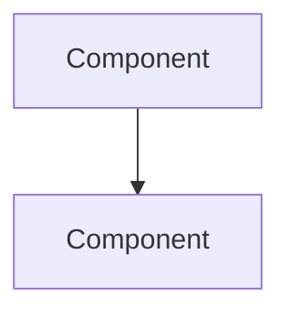

# Contributing

Thank you for contributing to System Design Mastery! This repo thrives on community contributions — whether it's fixing a typo, adding a new topic, or improving existing content.

## Quick Start

```bash
# 1. Fork the repo
# 2. Clone your fork
git clone https://github.com/YOUR_USERNAME/SystemDesignHandbook.git
cd SystemDesignHandbook

# 3. Create a branch
git checkout -b feat/your-feature-name

# 4. Make your changes
# 5. Validate locally (PowerShell)
pwsh .github/scripts/validate.ps1

# 6. Commit using conventional commits
git commit -m "feat: add XYZ topic"
git push origin feat/your-feature-name

# 7. Open a Pull Request
```

## Content Format

Every topic file follows this structure:

```markdown
# NN — Topic Name

> One-line description

## What Is It?
## Why It Was Created
## When to Use It



## Architecture Deep-Dive
## Hands-on Example
(Code, config, or CLI commands — NO inline comments)

## Pricing Model / Cost Considerations
## Best Practices
## Interview Questions
1. ...
## Real Company Usage
```

## File Organization

- **Topic files**: `NN-descriptive-name.md` (two-digit numbers, kebab-case)
- **Module READMEs**: Must include a table listing all topic files + `Previous:` / `Next:` navigation
- **Diagrams**: Every content file needs at least one Mermaid diagram (3+ content lines)
- **Cross-references**: Use relative paths like `../05-System-Design/consistent-hashing.md`

## Module Map

| # | Module | Description | File Count |
|---|--------|-------------|-----------|
| 01 | CS Fundamentals | CAP, scalability, latency, consistency | 14 |
| 02 | Networking | TCP/IP, HTTP, DNS, CDN | 14 |
| 03 | Linux | Processes, memory, FS, perf | 9 |
| 04 | Databases | SQL, NoSQL, sharding, Redis | 15 |
| 05 | System Design | Caching, queues, load balancers, patterns | 25 |
| 06 | Distributed Systems | Raft, Paxos, gossip, CRDTs | 12 |
| 07 | Microservices | DDD, Saga, CQRS, service mesh | 10 |
| 08 | Docker | Images, Compose, Swarm, production | 8 |
| 09 | Kubernetes | Pods, services, HPA, operators | 16 |
| 10 | AWS | 41 service deep-dives | 41 |
| 11 | Azure | 25 service deep-dives | 25 |
| 12 | GCP | 26 service deep-dives | 26 |
| 13 | Terraform | IaC, modules, state, CDKTF | 12 |
| 14 | DevOps | CI/CD, GitOps, Helm, Argo, platform | 14 |
| 15 | SRE | SLOs, error budgets, incident management | 13 |
| 16 | Security | Zero trust, OWASP, TLS, threat modeling | 20 |
| 17 | Observability | eBPF, Prometheus, Grafana, Jaeger | 17 |
| 18 | Case Studies | 25 real architectures + 7 incidents | 24 |
| 19 | Projects | 19 hands-on implementations | 19 |
| 20 | Interview Prep | 26 system design problems | 25 |
| 21 | Staff Engineer | Strategy, mentorship, RFCs, growth | 18 |
| 22 | AI/ML System Design | LLMs, RAG, vector DBs, AI agents | 11 |
| 23 | API Design | REST, GraphQL, gRPC, security | 10 |
| 24 | Testing & Quality | Contract, chaos, perf, CI strategy | 10 |
| 25 | Clean Architecture | SOLID, DDD, CQRS, event sourcing | 11 |

## Adding a New Topic

1. **Pick the right module** from the map above
2. **Create your file**: `NN-descriptive-name.md` (use the next available number)
3. **Follow the format**: Each file needs What/Why/When, Mermaid diagram, hands-on example, interview questions
4. **Update the module's README.md**: Add a row to the topic table
5. **Run validation**: `pwsh .github/scripts/validate.ps1`

## Adding a New Module

1. Create `NN-Module-Name/` directory with `NN` following the sequence
2. Create `README.md` with topic table, Mermaid overview, learning path, `Previous:` / `Next:` nav
3. Update root `README.md`: Add to Module Index table + Learning Path Mermaid diagram
4. Run validation to catch any cross-reference issues

## Pull Request Checklist

- [ ] Files follow `NN-descriptive-name.md` naming
- [ ] Every file has a Mermaid diagram (3+ lines)
- [ ] Module README lists the new file in its topic table
- [ ] Module README has correct `Previous:` / `Next:` links
- [ ] All cross-references use relative paths `../NN-Module/`
- [ ] No code comments in code blocks
- [ ] Validation passes: `pwsh .github/scripts/validate.ps1`
- [ ] Commit follows conventional commits: `feat:` / `fix:` / `docs:` / `refactor:`

## Code of Conduct

Be respectful, constructive, and inclusive. Focus on technical accuracy and practical value.

## License

By contributing, you agree that your contributions will be licensed under the MIT License.
