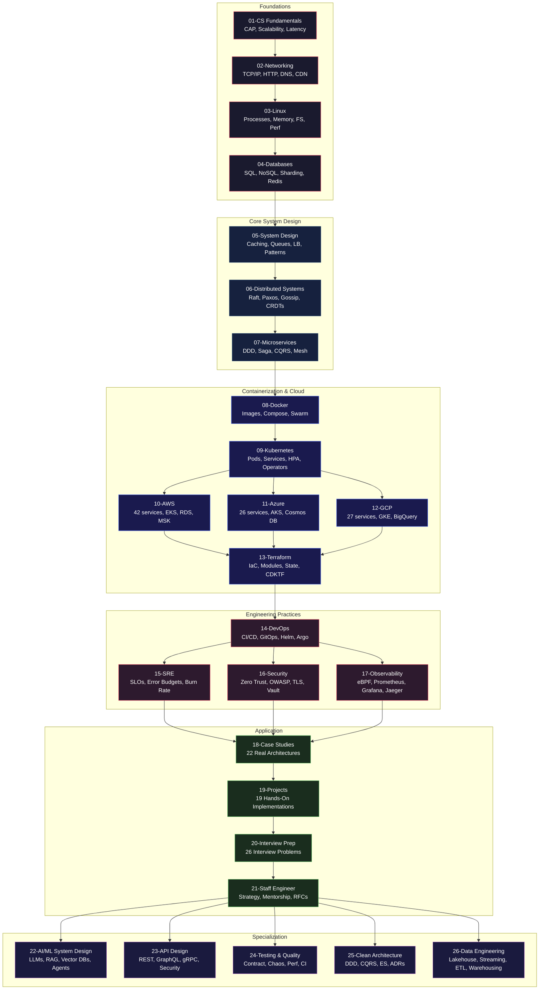

<div align="center">

# 🏆 System Design Mastery

### The Ultimate Cloud + System Design + DevOps + Architecture Operating System

**From zero to Staff Engineer — 520+ topics across 26 modules with 700+ Mermaid diagrams**

[](https://github.com/ajju853/SystemDesignHandbook/stargazers)
[](https://github.com/ajju853/SystemDesignHandbook/network/members)
[](CONTRIBUTING.md)
[](LICENSE)
[](https://github.com/ajju853/SystemDesignHandbook/commits/main)
[](https://www.conventionalcommits.org/)
[](https://github.com/ajju853/SystemDesignHandbook/actions/workflows/validate.yml)

<br/>

**[🚀 Quick Start](#how-to-use) • [📚 Modules](#-module-index) • [☁️ Multi-Cloud](#-multi-cloud-mapping) • [🎓 Certifications](#-certifications) • [💼 Interview Prep](#-interview-prep) • [🌐 Website](https://ajju853.github.io/SystemDesignHandbook/) • [👥 Community](#-community-and-contributing)**

<br/>

---

*The most comprehensive system design learning resource on GitHub. Covers everything from CAP theorem to Staff Engineer — with AWS, Azure, GCP, Kubernetes, Terraform, DevOps, SRE, Security, Observability, Data Engineering, and real-world architectures.*

</div>

<br/>

---

## 📋 What Makes This Different

| Feature | This Repo | Others |
|---------|-----------|--------|
| **Cloud Coverage** | ✅ AWS (42) + Azure (26) + GCP (27) = **95 cloud service files** | Usually 1 cloud or none |
| **Kubernetes** | ✅ 17 files — pods to operators, network policies to scaling | Usually 2-3 files |
| **Security** | ✅ 21 files — zero trust, OWASP, TLS/mTLS, threat modeling, secrets, API/container security | Usually 5-6 files |
| **Observability** | ✅ 18 files — eBPF, SLI/SLO deep-dive, commercial tools, dashboards, oncall | Usually 3-4 files |
| **Case Studies** | ✅ 22 real architectures — Netflix, Uber, Stripe, TikTok, Discord, DoorDash, Figma, Notion, Cloudflare, Coinbase, Roblox | Usually 5-10 |
| **Projects** | ✅ 19 hands-on — URL shortener → healthcare EMR with full end-to-end guide | Usually 3-5 |
| **Staff Engineer** | ✅ 19 files — mentorship, strategy, migrations, incident leadership, executive comm | Unique to this repo |
| **Mermaid Diagrams** | ✅ **700+ diagrams across 520+ files** | Usually text-only |
| **Interview Prep** | ✅ 26 problems — from Tinder to distributed KV store to recommendation systems | Usually 10-15 |
| **End-to-End Guide** | ✅ Complete E-Commerce platform from requirements to production SRE | Not offered |

---

## 🗺️ Learning Path



---

## 📚 Module Index

| # | Module | Files | Description |
|---|--------|-------|-------------|
| 01 | [Computer Science Fundamentals](01-Computer-Science-Fundamentals/) | 15 | CAP theorem, scalability, latency, throughput, consistency, replication, partitioning |
| 02 | [Networking](02-Networking/) | 15 | OSI, TCP, UDP, HTTP, HTTPS, REST, GraphQL, gRPC, DNS, CDN, WebSocket, HTTP/2, HTTP/3 |
| 03 | [Linux](03-Linux/) | 10 | Processes, memory management, file systems, networking, shell scripting, performance tuning, security hardening, containerization |
| 04 | [Databases](04-Databases/) | 16 | PostgreSQL, MySQL, MongoDB, Cassandra, DynamoDB, Redis, Elasticsearch, indexing, sharding, transactions, ACID, BASE, query optimization |
| 05 | [System Design](05-System-Design/) | 26 | Redis, Memcached, CDN, Kafka, RabbitMQ, SQS, Pulsar, caching patterns, load balancers, consistent hashing, bloom filters, rate limiters, CAP/PACELC, API gateway, ID generation |
| 06 | [Distributed Systems](06-Distributed-Systems/) | 16 | Consensus, Paxos, Raft, leader election, distributed locking, ZooKeeper, etcd, service discovery, BFT, gossip, CRDTs, distributed file systems, distributed transactions, distributed scheduling, caching patterns, coordination |
| 07 | [Microservices](07-Microservices/) | 11 | DDD, service decomposition, inter-service communication, service discovery, API gateway, circuit breaker, event-driven/Saga/CQRS, database-per-service, testing, observability |
| 08 | [Docker](08-Docker/) | 10 | Architecture, Dockerfile, multi-stage builds, Compose, networking, storage/volumes, security, Swarm, production best practices |
| 09 | [Kubernetes](09-Kubernetes/) | 17 | Pods (sidecar/ambassador/adapter), Deployments (rolling/canary), Services, ConfigMaps/Secrets, Ingress, Storage, RBAC, HPA/VPA, StatefulSets, Jobs, Network Policies, Operators/CRDs, kubectl, resource management |
| 10 | [AWS](10-AWS/) | 42 | EC2, Lambda, S3, VPC, RDS, DynamoDB, ElastiCache, SQS, SNS, Kinesis, API Gateway, CloudFront, Route53, ECS, EKS, IAM, CloudWatch, CloudTrail, Step Functions, CloudFormation, CodePipeline, SSM, Config, GuardDuty, Analytics, Cognito, MSK, AppSync |
| 11 | [Azure](11-Azure/) | 26 | VMs, Functions, AKS, Blob Storage, SQL, Cosmos DB, Load Balancer, Front Door, Monitor, Event Hub, Service Bus, Key Vault, Entra ID, Logic Apps, Defender, DevOps, Bicep/ARM, Policy, Cost Management, ADF/Synapse, API Management |
| 12 | [GCP](12-GCP/) | 27 | Compute Engine, GKE, Cloud Run, Functions, Cloud Storage, BigQuery, Spanner, Cloud SQL, Pub/Sub, Dataflow, Vertex AI, Memorystore, CDN, VPC, Cloud Armor, Secret Manager, Operations Suite, IAM, Deployment Manager, Composer/Dataproc, Scheduler, Apigee, Data Catalog |
| 13 | [Terraform](13-Terraform/) | 16 | IaC basics, core concepts, workflow, modules, state management, AWS provisioning, advanced patterns, Terraform Cloud, best practices, providers deep-dive, CDKTF, testing, Terragrunt, policy-as-code, multi-cloud, provider development |
| 14 | [DevOps](14-DevOps/) | 15 | Git workflows, GitHub Actions, Jenkins, ArgoCD, Helm, Ansible, CI/CD pipeline design, GitOps, progressive delivery, platform engineering/Backstage, shift-left |
| 15 | [SRE](15-SRE/) | 16 | SLO/SLI/error budgets, incident management, postmortem culture, change management, capacity planning, reliability patterns, toil reduction, emergency response, production readiness, SLI taxonomy, multi-window burn-rate alerting, error budget policy, SLO examples, SRE maturity model, SRE for ML, chaos engineering deep-dive |
| 16 | [Security](16-Security/) | 21 | Auth/AuthZ, JWT, OAuth 2.0, OIDC, RBAC, ABAC, encryption, hashing, WAF, DDoS, zero trust, OWASP Top 10, TLS/mTLS, secrets management (Vault), security headers/CSP, API security, container security, threat modeling (STRIDE/PASTA), compliance (SOC2/PCI/HIPAA/GDPR) |
| 17 | [Observability](17-Observability/) | 18 | Logging, monitoring, tracing, metrics, alerting, Prometheus, Grafana, ELK, Jaeger, OpenTelemetry, SLI/SLO deep-dive, commercial tools comparison, dashboard design, on-call practices, eBPF observability, maturity model, K8s observability |
| 18 | [Case Studies](18-Case-Studies/) | 29 | Netflix, YouTube, WhatsApp, Instagram, Uber, Twitter/X, Spotify, Airbnb, Amazon, Google Search, Slack, Discord, TikTok, Stripe, LinkedIn, Zoom, DoorDash, Figma, Notion, Cloudflare, Coinbase, Roblox + 7 production incidents (Facebook BGP, AWS Kinesis, Google Cloud, Cloudflare, GitHub, Fastly, GitLab) |
| 19 | [Projects](19-Projects/) | 20 | End-to-End Implementation Guide + URL Shortener, Chat System, Netflix Clone, YouTube, Uber, Payment Gateway, Instagram, Twitter, Dropbox, Google Drive, Food Delivery, Video Conferencing, Event Booking, Airline Reservation, Banking Ledger, Healthcare EMR, Java Full Stack Roadmap |
| 20 | [Interview Prep](20-Interview-Prep/) | 26 | TinyURL, Parking Lot, Rate Limiter, Web Crawler, Instagram, WhatsApp, Twitter, Uber, Dropbox, Netflix, YouTube, Google Search, Amazon, Multi-Region Banking, Global CDN, Analytics, Event-Driven, Tinder, Distributed KV Store, Notification System, Collaborative Editor, Elevator OOD, Distributed Cache, Job Scheduler, Recommendation System |
| 21 | [Staff Engineer](21-Staff-Engineer/) | 19 | Tradeoffs, architecture reviews, RFC writing, cost optimization, multi-region design, disaster recovery, chaos engineering, capacity planning, mentorship vs sponsorship, technical strategy, migration strategies, API versioning, executive communication, interviewing/hiring, technical debt management, incident leadership, engineering culture (DORA/SPACE), growth paths |
| 22 | [AI & ML System Design](22-AI-ML-System-Design/) | 16 | Transformer architecture, RAG, vector databases, model serving, prompt engineering, AI agent architectures, ML pipeline infra, model evaluation/monitoring, GPU optimization, cost optimization, AI system design examples, LLM fine-tuning, multimodal models, AI safety & alignment, model compression, MLOps platform |
| 23 | [API Design](23-API-Design/) | 15 | RESTful API design, OpenAPI 3.1, GraphQL (schema, resolvers, federation, N+1), gRPC (protobuf, 4 streaming modes), API versioning, API security (OAuth2, OIDC, JWT), API gateway patterns, WebSocket/SSE, webhooks, API testing, API documentation, GraphQL federation, API monetization, design-first workflow, BFF patterns |
| 24 | [Testing & Quality Engineering](24-Testing-Quality-Engineering/) | 15 | Testing strategies, unit/integration testing, contract testing, E2E testing, performance testing (k6, Locust), load testing patterns, chaos engineering, test infra, CI test strategy, quality metrics, visual testing, test data management, flaky test management, accessibility testing, mutation testing |
| 25 | [Clean Architecture & Design Patterns](25-Clean-Architecture-Design-Patterns/) | 12 | SOLID principles (multi-language), 23 GoF patterns, Clean Architecture, Hexagonal Architecture, Domain-Driven Design, CQRS, Event Sourcing, Saga pattern, Strangler Fig, ADRs, Twelve-Factor App |
| 26 | [Data Engineering](26-Data-Engineering/) | 15 | Data lakehouse, batch/stream processing, schema registry, data quality, ETL/ELT, warehousing, lake storage, orchestration, data catalog, real-time analytics, reverse ETL, governance, platform architecture |

---

## ☁️ Multi-Cloud Mapping

| Category | AWS | Azure | GCP |
|----------|-----|-------|-----|
| Compute | EC2 | Virtual Machines | Compute Engine |
| Serverless | Lambda | Functions | Cloud Functions |
| Containers | EKS / ECS | AKS | GKE |
| Object Storage | S3 | Blob Storage | Cloud Storage |
| Relational DB | RDS (Aurora) | Azure SQL | Cloud SQL / Spanner |
| NoSQL | DynamoDB | Cosmos DB | Bigtable / Firestore |
| Data Warehouse | Redshift | Synapse Analytics | BigQuery |
| Stream Processing | Kinesis | Event Hubs | Dataflow |
| Message Queue | SQS | Service Bus | Pub/Sub |
| API Gateway | API Gateway | API Management | Apigee |
| DNS | Route53 | DNS | Cloud DNS |
| CDN | CloudFront | Front Door | Cloud CDN |
| Monitoring | CloudWatch | Monitor | Operations Suite |
| Secrets | Secrets Manager | Key Vault | Secret Manager |

[**Full Multi-Cloud Mapping with 40+ services →**](12-GCP/19-multi-cloud-mapping.md)

---

## 🎓 Certifications

| Cloud | Foundational | Associate | Professional |
|-------|-------------|-----------|-------------|
| **AWS** | [Cloud Practitioner](10-AWS/32-certifications.md) | Solutions Architect Associate | Solutions Architect Professional |
| **Azure** | [AZ-900](11-Azure/19-certifications.md) | AZ-104 Administrator | AZ-305 Architect Expert |
| **GCP** | [Cloud Digital Leader](12-GCP/20-certifications.md) | Associate Cloud Engineer | Professional Cloud Architect |

---

## 💼 Interview Prep

| Level | Problems |
|-------|----------|
| 🟢 **Beginner** | TinyURL, Parking Lot (OOD), Rate Limiter, Web Crawler, Elevator System (OOD) |
| 🟡 **Intermediate** | Instagram, WhatsApp, Twitter, Uber, Dropbox, Notification System, Distributed Cache, Job Scheduler |
| 🔴 **Advanced** | Netflix, YouTube, Google Search, Amazon, Design Tinder, Distributed KV Store, Collaborative Editor, Recommendation System |
| 🔵 **Staff+** | Multi-Region Banking, Global CDN, Real-Time Analytics Platform, Event-Driven Architecture |

[**Full Interview Prep →**](20-Interview-Prep/README.md)

---

## 🚀 How to Use

```bash
# Clone
git clone https://github.com/ajju853/SystemDesignHandbook.git

# Beginner start
01-Computer-Science-Fundamentals/01-what-is-system-design.md

# Jump to your level:
# 🟢 Beginner:     Modules 01-05 (CS → Networking → Linux → DB → System Design)
#   🟡 Intermediate: Modules 06-12 (Dist Sys → Microservices → Docker → K8s → Cloud)
#   🔴 Advanced:     Modules 13-17 (Terraform → DevOps → SRE → Security → Observability)
#   🔵 Staff:        Module 21 (Staff Engineer: tradeoffs, strategy, leadership)
#   🟣 Specialization: Modules 22-25 (AI/ML, API Design, Testing, Clean Architecture)

# Build a real project:
19-Projects/12-end-to-end-implementation-guide.md
```

---

## 🌟 Key Highlights

<details>
<summary><b>📂 08-Docker (10 files)</b> — Docker basics → Dockerfile (multi-stage) → Compose → Networking → Storage/Volumes → Security → Swarm → Production</summary>

| File | Topic |
|------|-------|
| [01-docker-basics.md](08-Docker/01-docker-basics.md) | Architecture, installation, containers vs VMs |
| [02-dockerfile.md](08-Docker/02-dockerfile.md) | Instructions, multi-stage builds, best practices |
| [03-docker-compose.md](08-Docker/03-docker-compose.md) | Multi-container orchestration |
| [04-docker-networking.md](08-Docker/04-docker-networking.md) | Bridge, overlay, host, macvlan |
| [05-docker-storage.md](08-Docker/05-docker-storage.md) | Volumes, bind mounts, tmpfs |
| [06-docker-security.md](08-Docker/06-docker-security.md) | Non-root, capabilities, seccomp, scanning |
| [07-docker-swarm.md](08-Docker/07-docker-swarm.md) | Native orchestration, services, stacks |
| [08-docker-production.md](08-Docker/08-docker-production.md) | Best practices, monitoring, orchestration comparison |
</details>

<details>
<summary><b>☸️ 09-Kubernetes (17 files)</b> — Pods → Deployments → Services → ConfigMaps → Ingress → Storage → RBAC → HPA → StatefulSets → Jobs → Network Policies → Operators → kubectl → Resource Mgmt</summary>

| File | Topic |
|------|-------|
| [02-pods.md](09-Kubernetes/02-pods.md) | Multi-container patterns, lifecycle, QoS |
| [03-deployments.md](09-Kubernetes/03-deployments.md) | ReplicaSets, rollout strategies, rollback |
| [04-services.md](09-Kubernetes/04-services.md) | ClusterIP, NodePort, LoadBalancer, DNS |
| [05-configmaps-secrets.md](09-Kubernetes/05-configmaps-secrets.md) | Configuration injection, secret types |
| [06-ingress.md](09-Kubernetes/06-ingress.md) | HTTP routing, TLS, controllers |
| [07-storage.md](09-Kubernetes/07-storage.md) | PV/PVC, StorageClass, CSI |
| [08-rbac-security.md](09-Kubernetes/08-rbac-security.md) | Roles, service accounts, Pod Security Standards |
| [09-hpa-scaling.md](09-Kubernetes/09-hpa-scaling.md) | Autoscaling, custom metrics, VPA |
| [10-statefulsets-daemonsets.md](09-Kubernetes/10-statefulsets-daemonsets.md) | Stateful workloads, node-level agents |
| [11-jobs-cronjobs.md](09-Kubernetes/11-jobs-cronjobs.md) | Batch processing, scheduled tasks |
| [12-network-policies.md](09-Kubernetes/12-network-policies.md) | Pod isolation, Cilium L7 |
| [14-operators-crds.md](09-Kubernetes/14-operators-crds.md) | Custom resources, controller pattern |
| [15-kubectl-commands.md](09-Kubernetes/15-kubectl-commands.md) | Command reference, output formatting |
| [16-resource-management.md](09-Kubernetes/16-resource-management.md) | QoS, LimitRange, ResourceQuota, PriorityClass |
</details>

<details>
<summary><b>🔐 16-Security (21 files)</b> — Auth/AuthZ → JWT → OAuth → OIDC → RBAC → ABAC → Encryption → Zero Trust → OWASP → TLS/mTLS → Secrets → CSP → API/Container Sec → Threat Modeling → Compliance</summary>

| File | Topic |
|------|-------|
| [13-zero-trust-architecture.md](16-Security/13-zero-trust-architecture.md) | Zero Trust: never trust, always verify |
| [14-owasp-top-10.md](16-Security/14-owasp-top-10.md) | OWASP Top 10 with mitigation strategies |
| [15-tls-mtls-deep-dive.md](16-Security/15-tls-mtls-deep-dive.md) | TLS 1.3 handshake, mTLS for service mesh |
| [16-secrets-management.md](16-Security/16-secrets-management.md) | Vault, dynamic secrets, rotation strategies |
| [17-security-headers-csp.md](16-Security/17-security-headers-csp.md) | CSP, HSTS, XSS protection, CORS |
| [18-api-security.md](16-Security/18-api-security.md) | API authentication, rate limiting, schema validation |
| [19-container-security.md](16-Security/19-container-security.md) | Image scanning, runtime security, K8s security |
| [20-threat-modeling.md](16-Security/20-threat-modeling.md) | STRIDE, PASTA, threat trees, risk assessment |
</details>

<details>
<summary><b>📊 17-Observability (18 files)</b> — Logging → Monitoring → Tracing → Metrics → Prometheus → Grafana → ELK → Jaeger → OpenTelemetry → SLI/SLO → Dashboards → Oncall → eBPF → Maturity Model → K8s Obs</summary>

| File | Topic |
|------|-------|
| [11-sli-slo-sla-deep-dive.md](17-Observability/11-sli-slo-sla-deep-dive.md) | SLI types, SLO calculation, error budget math |
| [12-commercial-observability.md](17-Observability/12-commercial-observability.md) | Datadog vs New Relic vs Splunk vs Honeycomb |
| [13-dashboard-design.md](17-Observability/13-dashboard-design.md) | USE/RED method, Grafana dashboard patterns |
| [14-oncall-practices.md](17-Observability/14-oncall-practices.md) | Rotation design, pagers, escalation, burnout prevention |
| [15-ebpf-observability.md](17-Observability/15-ebpf-observability.md) | Cilium, Pixie, Falco, eBPF deep-dive |
| [16-observability-maturity-model.md](17-Observability/16-observability-maturity-model.md) | 5 levels from reactive to predictive |
| [17-k8s-observability.md](17-Observability/17-k8s-observability.md) | K8s metrics, kube-state-metrics, cAdvisor, K8s-specific dashboards |
</details>

<details>
<summary><b>🏗️ 18-Case Studies (25 files)</b> — Netflix → YouTube → WhatsApp → Instagram → Uber → Twitter → Spotify → Airbnb → Amazon → Google Search + 7 incidents + Slack → Discord → TikTok → Stripe → LinkedIn → Zoom → DoorDash</summary>

| New Case Studies | Key Lessons |
|-----------------|-------------|
| [Slack Architecture](18-Case-Studies/11-slack-architecture.md) | WebSocket gateway, real-time presence, 10M DAU |
| [Discord Architecture](18-Case-Studies/12-discord-architecture.md) | Elixir + ScyllaDB, voice channels, 150M MAU |
| [TikTok Architecture](18-Case-Studies/13-tiktok-architecture.md) | For You algorithm, ML recommendation, viral loops |
| [Stripe Architecture](18-Case-Studies/14-stripe-architecture.md) | Idempotency, payment orchestration, 24/7 uptime |
| [LinkedIn Architecture](18-Case-Studies/15-linkedin-architecture.md) | Feed ranking, Kafka, graph database, 1B members |
| [Zoom Architecture](18-Case-Studies/16-zoom-architecture.md) | WebRTC, SFU, media routing, 300M daily participants |
| [DoorDash Architecture](18-Case-Studies/17-door-dash-architecture.md) | Dispatch engine, real-time pricing, 25M orders/mo |
| [Figma Architecture](18-Case-Studies/18-figma-architecture.md) | CRDT collaboration, WASM rendering, local-first sync |
| [Notion Architecture](18-Case-Studies/19-notion-architecture.md) | Block data model, OT/CRDT hybrid, database queries |
| [Cloudflare Architecture](18-Case-Studies/20-cloudflare-architecture.md) | Anycast network, DDoS mitigation, Workers edge compute |
| [Coinbase Architecture](18-Case-Studies/21-coinbase-architecture.md) | Wallet HD architecture, order matching, blockchain indexer |
| [Roblox Architecture](18-Case-Studies/22-roblox-architecture.md) | Multiplayer networking, UGC platform, 70M DAU |
</details>

<details>
<summary><b>🛠️ 19-Projects (20 files)</b> — End-to-End Guide + Java Full Stack Roadmap + 18 hands-on projects</summary>

| New Projects | Stack | Key Concepts |
|-------------|-------|-------------|
| [Java Full Stack Roadmap](19-Projects/19-java-full-stack-roadmap.md) | Spring Boot + React + EKS + Kafka + Terraform | Complete SDLC from commit to production |
| [Video Conferencing](19-Projects/13-video-conferencing.md) | WebRTC, SFU, media servers | Real-time media, mesh vs SFU, simulcast |
| [Realtime Chat Platform](19-Projects/14-realtime-chat-platform.md) | WebSocket, Redis, Kafka | Presence, history, fanout, horizontal scaling |
| [Event Booking System](19-Projects/15-event-booking-system.md) | PostgreSQL, Redis, Stripe | Ticket reservation, race conditions, dead letter |
| [Airline Reservation](19-Projects/16-airline-reservation.md) | CQRS, Event Sourcing, Saga | Inventory, booking lifecycle, payment flow |
| [Banking Ledger](19-Projects/17-banking-ledger.md) | Double-entry, ACID, idempotency | Immutable ledger, reconciliation, audit trail |
| [Healthcare EMR](19-Projects/18-healthcare-emr.md) | FHIR, HIPAA compliance | Patient records, interoperability, audit logging |
</details>

<details>
<summary><b>📝 20-Interview Prep (26 files)</b> — TinyURL → Parking Lot → Rate Limiter → Web Crawler → Instagram → WhatsApp → Twitter → Uber → Dropbox → Netflix → YouTube → Google Search → Amazon + 8 new</summary>

| New Interview Problems | Key Concepts |
|----------------------|-------------|
| [Design Tinder](20-Interview-Prep/18-design-tinder.md) | Geo-indexing, matching algorithm, swipe queues |
| [Distributed KV Store](20-Interview-Prep/19-distributed-kv-store.md) | Consistent hashing, quorum, gossip, hinted handoff |
| [Notification System](20-Interview-Prep/20-design-notification-system.md) | Template engine, delivery channels, batching, retry |
| [Collaborative Editor](20-Interview-Prep/21-design-collaborative-editor.md) | OT vs CRDT, operational transformation, YATA |
| [Elevator System (OOD)](20-Interview-Prep/22-elevator-system-ood.md) | Object-oriented design, state machine, scheduling |
| [Distributed Cache](20-Interview-Prep/23-design-cache.md) | Redis cluster, consistent hashing, eviction policies |
| [Job Scheduler](20-Interview-Prep/24-design-job-scheduler.md) | Priority queues, cron semantics, distributed scheduling |
| [Recommendation System](20-Interview-Prep/25-design-recommendation.md) | Collaborative filtering, content-based, hybrid approaches |
</details>

<details>
<summary><b>👔 21-Staff Engineer (19 files)</b> — Tradeoffs → Design Reviews → RFCs → Strategy → Mentorship → Migration → API Versioning → Executive Comm → Tech Debt → Incident Leadership → Culture → Growth</summary>

| New Staff Engineer Files | Description |
|------------------------|-------------|
| [Mentorship vs Sponsorship](21-Staff-Engineer/09-mentorship-sponsorship.md) | Coaching frameworks, sponsorship in action, building the next generation |
| [Technical Strategy](21-Staff-Engineer/10-technical-strategy.md) | Strategy vs tactics, Wardley Mapping, OKR alignment |
| [Migration Strategies](21-Staff-Engineer/11-migration-strategies.md) | Strangler Fig, parallel run, big bang, rollback planning |
| [API Versioning](21-Staff-Engineer/12-api-versioning.md) | URL vs header vs media-type versioning, backward compatibility |
| [Executive Communication](21-Staff-Engineer/13-executive-communication.md) | The 3-2-1 method, executive summaries, influencing decisions |
| [Interviewing & Hiring](21-Staff-Engineer/14-interviewing-hiring.md) | Structured interviews, rubric design, fair evaluation |
| [Technical Debt Management](21-Staff-Engineer/15-technical-debt-management.md) | Fowler quadrant, debt quantification, repayment strategies |
| [Incident Leadership (IC Role)](21-Staff-Engineer/16-incident-leadership.md) | Incident command, communication, post-incident action items |
| [Engineering Culture (DORA/SPACE)](21-Staff-Engineer/17-engineering-culture.md) | DORA metrics, SPACE framework, developer experience |
| [Growth Paths](21-Staff-Engineer/18-growth-paths.md) | Staff → Principal → Distinguished → Fellow: skills and expectations |
</details>

<details>
<summary><b>🤖 22-AI & ML System Design (12 files)</b> — Transformer Architecture → RAG → Vector DBs → Model Serving → Prompt Engineering → AI Agents → ML Pipeline → Evaluation/Monitoring → GPU Optimization → Cost Optimization → System Design Examples</summary>

| File | Topic |
|------|-------|
| [Transformer Architecture](22-AI-ML-System-Design/01-transformer-architecture.md) | Attention mechanism, multi-head attention, KV cache, RoPE, GQA |
| [RAG Architecture](22-AI-ML-System-Design/02-rag-architecture.md) | Chunking, embeddings, hybrid search, reranking, RAG fusion, multi-modal RAG |
| [Vector Databases](22-AI-ML-System-Design/03-vector-databases.md) | Pinecone, Weaviate, Milvus, FAISS, HNSW, IVF, PQ, hybrid search |
| [Model Serving](22-AI-ML-System-Design/04-model-serving.md) | vLLM (PagedAttention), TGI, Triton, TensorRT-LLM, continuous batching, quantization |
| [Prompt Engineering](22-AI-ML-System-Design/05-prompt-engineering-patterns.md) | Few-shot, CoT, ReAct, ToT, DSPy, guardrails, injection prevention |
| [AI Agent Architectures](22-AI-ML-System-Design/06-ai-agent-architectures.md) | Agent loops, tool use, function calling, multi-agent, memory, planning |
| [ML Pipeline Infra](22-AI-ML-System-Design/07-ml-pipeline-infra.md) | Feature stores (Feast), data versioning (DVC), experiment tracking (MLflow, W&B) |
| [Model Evaluation & Monitoring](22-AI-ML-System-Design/08-model-evaluation-monitoring.md) | LLM evals, hallucination detection, drift, LangSmith, Weave |
| [GPU Optimization](22-AI-ML-System-Design/09-gpu-optimization.md) | CUDA, Flash Attention, PagedAttention, speculative decoding, parallelism |
| [Cost Optimization](22-AI-ML-System-Design/10-cost-optimization.md) | Caching, distillation, pruning, LoRA vs full fine-tune, spot instances |
| [AI System Design Examples](22-AI-ML-System-Design/11-ai-system-design-examples.md) | Chatbot, RAG pipeline, code assistant, recommendation, moderation |
</details>

<details>
<summary><b>🔌 23-API Design (11 files)</b> — RESTful Design → OpenAPI → GraphQL → gRPC → Versioning → Security → Gateway Patterns → WebSocket/SSE → Webhooks → API Testing</summary>

| File | Topic |
|------|-------|
| [RESTful API Design](23-API-Design/01-rest-api-design.md) | Resource modeling, HTTP methods, status codes, HATEOAS, pagination, idempotency |
| [OpenAPI Spec](23-API-Design/02-openapi-spec.md) | OpenAPI 3.1, code generation, Swagger UI, Redoc, Spectral validation |
| [GraphQL Deep-Dive](23-API-Design/03-graphql-deep-dive.md) | Schema, resolvers, N+1 (DataLoader), federation, security (depth, complexity) |
| [gRPC Deep-Dive](23-API-Design/04-grpc-deep-dive.md) | Protobuf, 4 streaming modes, interceptors, deadlines, REST/GraphQL comparison |
| [API Versioning](23-API-Design/05-api-versioning.md) | URI vs header vs query, semver, breaking change detection, sunset policies |
| [API Security](23-API-Design/06-api-security.md) | OAuth2 flows, OIDC, JWT, rate limiting algos, OWASP API Top 10 |
| [API Gateway Patterns](23-API-Design/07-api-gateway-patterns.md) | BFF, aggregation, circuit breaking, Kong, Apigee, gateway vs service mesh |
| [WebSocket & SSE](23-API-Design/08-websocket-sse.md) | WebSocket protocol, SSE, long polling, Redis pub/sub, reconnection |
| [Webhook Patterns](23-API-Design/09-webhook-patterns.md) | Retry/backoff, HMAC signing, filtering, batching, DLQ, verification |
| [API Testing](23-API-Design/10-api-testing.md) | Contract testing (Pact), fuzzing, property-based, Testcontainers, k6 |
</details>

<details>
<summary><b>🧪 24-Testing & Quality Engineering (11 files)</b> — Strategies → Unit/Integration → Contract → E2E → Performance → Load Patterns → Chaos → Test Infra → CI Strategy → Quality Metrics</summary>

| File | Topic |
|------|-------|
| [Testing Strategies](24-Testing-Quality-Engineering/01-testing-strategies.md) | Test pyramid, shift-left, risk-based, test environments strategy |
| [Unit & Integration Testing](24-Testing-Quality-Engineering/02-unit-integration-testing.md) | Mocking, test doubles, DI, Testcontainers, DB testing |
| [Contract Testing](24-Testing-Quality-Engineering/03-contract-testing.md) | Pact CDC, provider verification, Broker, can-i-deploy |
| [E2E Testing](24-Testing-Quality-Engineering/04-end-to-end-testing.md) | Cypress, Playwright, Selenium, visual regression (Percy) |
| [Performance Testing](24-Testing-Quality-Engineering/05-performance-testing.md) | k6, Locust, Gatling, JMeter, metrics (latency, throughput, p99) |
| [Load Testing Patterns](24-Testing-Quality-Engineering/06-load-testing-patterns.md) | Ramp-up, spike, soak, breakpoint, closed vs open model |
| [Chaos Engineering](24-Testing-Quality-Engineering/07-chaos-engineering.md) | Principles, GameDays, Chaos Mesh, Litmus, Gremlin |
| [Test Infrastructure](24-Testing-Quality-Engineering/08-test-infrastructure.md) | Testcontainers, ephemeral envs, preview deploys, DB seeding |
| [CI Test Strategy](24-Testing-Quality-Engineering/09-ci-test-strategy.md) | Test selection, impact analysis, flaky detection, quality gates |
| [Quality Metrics](24-Testing-Quality-Engineering/10-quality-metrics.md) | Coverage (line/branch/mutation), DORA metrics, SLI/SLO for quality |
</details>

<details>
<summary><b>🏛️ 25-Clean Architecture & Design Patterns (12 files)</b> — SOLID → GoF → Clean → Hexagonal → DDD → CQRS → Event Sourcing → Saga → Strangler Fig → ADRs → Twelve-Factor</summary>

| File | Topic |
|------|-------|
| [SOLID Principles](25-Clean-Architecture-Design-Patterns/01-solid-principles.md) | SRP, OCP, LSP, ISP, DIP with Go/TS/Python/Rust examples |
| [GoF Design Patterns](25-Clean-Architecture-Design-Patterns/02-gof-patterns.md) | All 23 patterns — creational, structural, behavioral (multi-language) |
| [Clean Architecture](25-Clean-Architecture-Design-Patterns/03-clean-architecture.md) | Dependency rule, entities/use cases/adapters, screaming architecture |
| [Hexagonal Architecture](25-Clean-Architecture-Design-Patterns/04-hexagonal-architecture.md) | Ports & adapters, driving/driven adapters, Clean vs Onion comparison |
| [Domain-Driven Design](25-Clean-Architecture-Design-Patterns/05-domain-driven-design.md) | Ubiquitous language, bounded contexts, aggregates, domain events |
| [CQRS Pattern](25-Clean-Architecture-Design-Patterns/06-cqrs-pattern.md) | Command/query separation, separate DBs, event-driven CQRS |
| [Event Sourcing](25-Clean-Architecture-Design-Patterns/07-event-sourcing.md) | Event store (PostgreSQL), snapshots, replay, projections, versioning |
| [Saga Pattern](25-Clean-Architecture-Design-Patterns/08-saga-pattern.md) | Choreography vs orchestration, compensation, Kafka/Temporal |
| [Strangler Fig Pattern](25-Clean-Architecture-Design-Patterns/09-strangler-fig-pattern.md) | Incremental migration, feature flags, database decomposition |
| [Architecture Decision Records](25-Clean-Architecture-Design-Patterns/10-architecture-decision-records.md) | ADR format, lifecycle, tools, Netflix/Spotify practices |
| [Twelve-Factor App](25-Clean-Architecture-Design-Patterns/11-twelve-factor-app.md) | All 12 factors with code/config, serverless & K8s interpretations |
</details>

---

## 👥 Community and Contributing

We welcome contributions of all kinds!

- **📖 Add content**: Improve existing topics or add new ones
- **🐛 Fix issues**: Broken links, typos, or outdated information
- **💡 Suggest topics**: Open an issue with your suggestion
- **🌍 Translations**: Help make this resource accessible globally

See [CONTRIBUTING.md](CONTRIBUTING.md) for guidelines.

| 💬 Join the conversation |
|--------------------------|
| [](https://github.com/ajju853/SystemDesignHandbook/issues) |
| [](https://github.com/ajju853/SystemDesignHandbook/discussions) |

---

## 📈 Star History

<p align="center">
  <a href="https://star-history.com/#ajju853/SystemDesignHandbook&Timeline">
    
  </a>
</p>

---

## 📄 License

This project is licensed under the MIT License — see the [LICENSE](LICENSE) file for details.

---

<div align="center">

**If you find this useful, please [⭐ star the repo](https://github.com/ajju853/SystemDesignHandbook) — it helps others discover it!**

**[⬆ Back to Top](#-system-design-mastery)**

</div>
