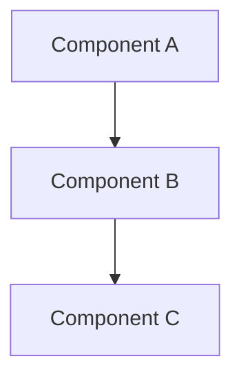

# Diagrams

This directory contains architectural diagrams for the System Design Mastery repository.

## Contents

- **System Architecture Templates** — Boilerplate diagrams for reuse
- **Reference Diagrams** — Complex architecture visualizations

## Diagram Types

### Module 1: Fundamentals
- CAP Theorem triangle
- Consistency models comparison
- Replication strategies

### Module 2: Networking
- OSI Model layers
- DNS resolution chain
- CDN request flow
- TLS handshake

### Module 3: Databases
- Sharding architectures
- Index structures (B-Tree, LSM)
- Replication topologies

### Module 10: Open Source Architectures
- Netflix streaming pipeline
- Uber dispatch system
- WhatsApp messaging flow

### Module 11: Production Incidents
- Facebook BGP route leak
- Fastly cascading failure
- GitLab backup chain

## Usage

Diagrams are embedded as Mermaid code blocks in the Markdown files. To render:

1. **GitHub**: Mermaid is natively supported in GitHub Markdown
2. **VS Code**: Install the "Mermaid Preview" extension
3. **Standalone**: Use the [Mermaid Live Editor](https://mermaid.live)

## Creating New Diagrams

Add diagrams directly as Mermaid code blocks in the relevant `.md` file:

## Interview Practice

Use these diagrams to:
1. Practice explaining architecture flows
2. Replicate on whiteboard for interviews
3. Understand component interactions
